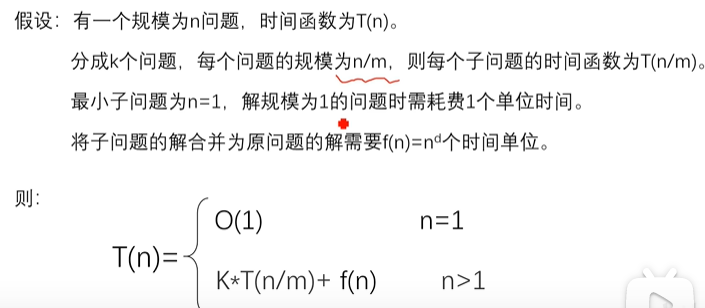
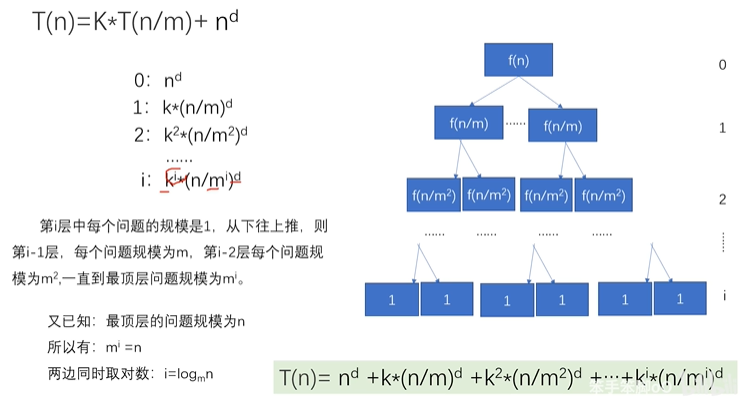
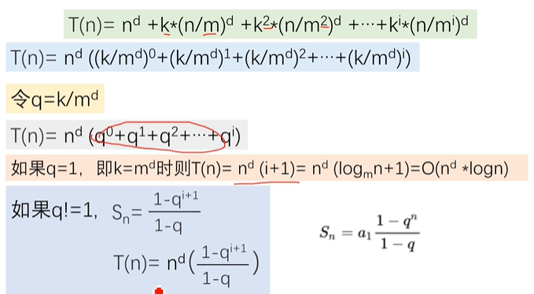
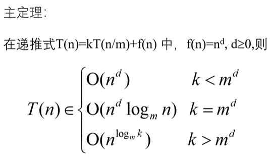

? SQL几乎题题不会做，要凉了

下列SQL语句用法错误的是（    ）

##### 正确答案: C  你的答案: 空 (错误)

```sql
A. delete from table-name where null=null
B. truncate table table-name
C. alter table table-name add column id int
D. select * from table-name where 3&gt;4
```

---

以下函数调用会选择哪个重载函数（）
func(1,2);

### 正确答案: B  你的答案: C (错误)

```c
A int func(int a)
B int func(int a, char b);
C int func(int a, float b);
D int func(int a, char *b);
```

C++ Primer Plus（第六版中文版），P290中写有，当遇到重载函数的时候，编译器如何选择？

- 完全匹配
- 提升转换(char,short → int,float→double)
- 标准转换(int → char , long → double)
- 用户定义的转换

---

Linux下哪个命令可以用于判断host1主机是否能够访问host2主机的端口

**ping用来检查网络是否通畅或者网络连接速度的命令** 
**telnet是用来探测指定ip是否开放指定端口**


---

以下关于操作系统，说法错误的是（）

#### 正确答案: B  你的答案: 空 (错误)

```
A 用管程实现进程同步时，管程中的过程是不可中断的
B 多道程序的执行失去了封闭性和再现性，因此多道程序系统不需要封闭性和再现性
C 使用SPOOLING技术可以实现虚拟设备
D 当 CPU 处于管态时，它可以执行计算机系统中的全部指令
```

**封闭性：**指的是程序一但开始执行，其计算结果就取决于程序本身，不受外界因素影响。

**可再现性：**是指当程序重复执行多次时，必将得到相同结果。

**事实：**程序并发执行的时候可能失去封闭性和可再现性（即 一个多道程序可能具有封闭性和可再现性）

任何程序都需要封闭性和可再性

---

有一个算法的递推关系式为：T(n) = 9 T(n / 3) + n，则该算法的时间复杂度为（**O(n^2)**）

还是要用主定理


分治法能够解决的问题特征：

1. 可以分
2. 分到小到一定程度可解
3. 子问题能合并为原问题
4. 子问题独立（不包含公共子问题）









T(n) = 9 T(n / 3) + n

k  = 9 , m = 3 , d = 1

9 > 3 ^ 1

T(n)  = O(n^log3(9)) = O(n^2)

---

由下面5个点:1,1,2,3,5构成的哈夫曼树的带权路径长度为（25）

注意是5个结点，不是出现次数好吧

**树的带权路径长度=求和(叶子结点权值*对应层数) 根为第0层**

```c
          12
       7     5
    4    3
  2   2
1   1
```

1 * 4 + 1 * 4 + 2 * 3 + 3 * 2 + 5 * 1 =  4 + 4 + 6 + 6 + 5 = 25


我们的目标是，结合**频率相关**和**前缀不重复（prefix-free）**，构建一颗针对某一文本最优的二叉树，我们把这棵树就叫哈夫曼树（Huffman tree）。


- 统计文本中字符出现的次数
- 将字符按照频数升序排序
- 将频数最小的两个叶子结点结合成树，看作一个整体，整体的频数是叶子结点频数和
- 把这个树看作整体和其他的一起也进行升序排序
- 重复上述过程知道生成整棵树

---

给定一棵二叉树的前序和后序，你却不能确定其中序遍历序列，考虑如下图中

 所有这些二叉树都有着相同的前序遍历和后序遍历，但中序遍历却不相同。


#### [889. 根据前序和后序遍历构造二叉树](https://leetcode-cn.com/problems/construct-binary-tree-from-preorder-and-postorder-traversal/)

返回与给定的前序和后序遍历匹配的任何二叉树。

**方法一：递归**

前序遍历为：

* `(根结点) (前序遍历左分支) (前序遍历右分支)`

  

而后序遍历为：

* `(后序遍历左分支) (后序遍历右分支) (根结点)`


若一颗二叉树的前序遍历为**a,b,c,d**,后序遍历为**b,c,d,a,**那么它的中序遍历为(?) // 可能题出错了


```c
我冥思苦想很久，着实觉得这根本不可能构造出一棵树。
889. 根据前序和后序遍历构造二叉树

测试用例：
[1,2,3,4]
[2,3,4,1]

执行结果：
执行出错
There should be at least one valid tree for the given input.

这道题应该题错了好吧
```


这套题的编程题怎么几乎都是数学啊啊啊

**这两道题都还没有吃透**

---

### 编程第二题

牛牛和羊羊都很喜欢青草。今天他们决定玩青草游戏。
最初有一个装有n份青草的箱子,牛牛和羊羊依次进行,牛牛先开始。在每个回合中,每个玩家必须吃一些箱子中的青草,所吃的青草份数必须是4的x次幂,比如1,4,16,64等等。不能在箱子中吃到有效份数青草的玩家落败。假定牛牛和羊羊都是按照最佳方法进行游戏,请输出胜利者的名字。

输入包括t+1行。

第一行包括一个整数t（1<=t<=100），表示情况数；

接下来t行，每一行一个n（1<=n<=10^9），表示青草份数

输出：对于每一个n，牛牛胜输出“niu”，羊羊胜输出“yang”。

样例：

3

1

2

3

输出：

niu

yang

niu


思想：

1：牛牛吃1，牛牛胜

2：牛牛吃1，羊羊吃1，羊胜

3：牛牛吃1，羊羊吃1，牛牛吃1，牛牛胜

4：牛牛吃4，牛牛胜

5：不管是牛牛吃1还是吃4，最后都是羊羊胜

6：1,1,4随机排序，都是牛羊牛的吃草循序，最后都是牛牛胜；也就是说，将1和4作为最后的吃草份数，在不计最后的1和4时，之前的份数最终是谁吃完的，就是谁胜，所以又进入了一个1和4的循环（也就是周期为5）；也就是说，当5以后时，牛牛和羊羊都会以最优的方式来吃，在最后都会使自己吃完剩下的数为5，那么不管是谁，最后胜的都是自己，基本上是以5为周期来确定，这样问题就解决了。

有人可能会说那17（16+1）、65（64+1）等等，这个就不能确定了？但是要注意，题目是说最优吃草方式，比如说，当羊羊吃完还剩17时，牛牛如果吃16或1时，那么羊羊肯定是胜利者，所以牛牛不会选择吃16或1，所以他会选择吃4，这时就又会进入支持1和4的循环中了，也就是5份为一轮。65和129之后都是同样的道理，感兴趣的可以自己去算一下，但是要注意是最优吃草方式，所以让对方赢的可能是在遵循规则下逼不得已出现的。

代码：

```c++
#include <iostream>
using namespace std;
 
int main()
{     
    int t;     
    cin >> t;     
    while (t--) {         
        int n;         
        cin >> n;         
        int f = n % 5;         
        switch (f) {         
            case 1:cout << "niu\n"; break;         
            case 2:cout << "yang\n"; break;         
            case 3:cout << "niu\n"; break;         
            case 4:cout << "niu\n"; break;         
            case 0:cout << "yang\n"; break;         
        }     
    } 
}
```


---

### 编程第三题

牛牛和羊羊非常无聊.他们有n + m个共同朋友,他们中有n个是无聊的,m个是不无聊的。每个小时牛牛和羊羊随机选择两个不同的朋友A和B.(如果存在多种可能的pair(A, B),任意一个被选到的概率相同。),然后牛牛会和朋友A进行交谈,羊羊会和朋友B进行交谈。在交谈之后,如果被选择的朋友之前不是无聊会变得无聊。现在你需要计算让所有朋友变得无聊所需要的时间的期望值。

##### **输入描述:**

```
输入包括两个整数n 和 m(1 ≤ n, m ≤ 50)
```

##### **输出描述:**

```
输出一个实数,表示需要时间的期望值,四舍五入保留一位小数。
```

## 知识点：递推 数学逻辑

## 思路：

本题考察递推公式，
1.本题将n无聊，m为不无聊。总共人数为s=n+m。每次从其中随机选出2个，将这两个数中的不无聊变成无聊，最终将s个人全部变成无聊。

2.假设当S个人中有K个人是不无聊，设平均需要f(K)次操作使得S个人全部变为无聊。每一次操作存在3种可能性：

K个不无聊的人都没有被选中，任然存在K个人处于不无聊。概率为：C(s - k, 2)/C(s, 2)

K个不无聊的人中选中了一个，此步后存在K-1个人处于不无聊。概率为：(s - k) * k / C(s, 2)

K个不无聊的人种选中了2个人，此步后存在K-2个人处于不无聊。概率为： C(k, 2)/C(s, 2)

因此：f(k) = 1 + C(s - k, 2) / C(s, 2) f(k) + (s - k) k / C(s, 2) )f(k - 1 )+ C(k, 2) / C(s, 2) f(k - 2)

### 【注】其中的1为该步骤需要付出的时间

由于f(0)=0；
由此：f(1):带入上述公式可得：f(1)-[(s-2)/s]f(1)=1 即：f(1)=s/2；

### 采用递推方式进行：

1.首先f0=0,f1=s/2;
采用for循环 利用公式：

f(k) = 1 + C(s - k, 2) / C(s, 2) f(k) + (s - k) k / C(s, 2) )f(k - 1 )+ C(k, 2) / C(s, 2) f(k - 2) ,

其中cur表示f(k),f(k-1)=f1,f(k - 2)=f0。
当计算出cur后，f0=f1,f1=cur。

### 四舍五入保留一位小数：
例：保留五位小数：

```c++
#include <iostream>
#include <iomanip>
using namespace std;
int main(){
    float a;
    cin>>a;
    cout<<fixed<<setprecision(5)<<a;
}
```

## 本题完整代码

```c++
#include<iostream>
#include <iomanip>
using namespace std;
int main(){
    int n,m;
    cin>>n>>m;
    int s=n+m;
    double f0=0,f1=s/2.0;
    for(int k=2;k<=m;k++){
        double cur = s * (s - 1) / (1.0 * k * (2 * s - k - 1)) + 2 * (s - k) * 1.0 / (2 * s - k - 1) * f1 + (k - 1) * 1.0 / (2 * s - k - 1) * f0;
        f0 = f1;
        f1 = cur;
    }
    cout<<fixed<<setprecision(1)<<f1<<endl;
    return 0;
}
```

