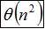
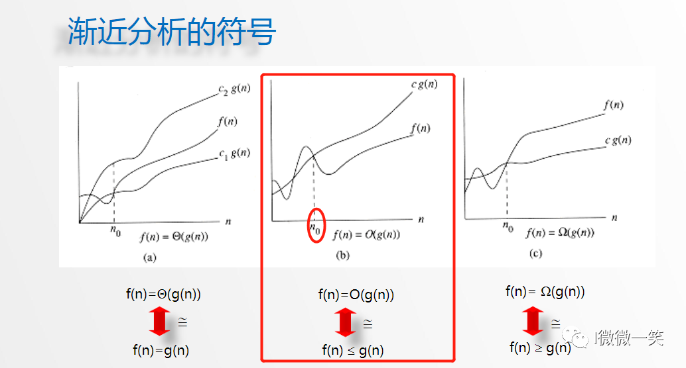

**来看一下这道面试题：求x的n次方**

直观的方式应该就是，一个for循环求出结果，代码如下

```c
int function1(int x, int n) {
    int result = 1;  // 注意 任何数的0次方等于1
    for (int i = 0; i < n; i++) {
        result = result * x;
    }
    return result;
}
```

时间复杂度为`O(n)`


递归算法的时间复杂度本质上是要看: **递归的次数 \* 每次递归中的操作次数**

于是同学又写出了这样的一个递归的算法的代码如下 ，来求 x的n次方

```c
int function3(int x, int n) {
    if (n == 0) {
        return 1;
    }
    if (n % 2 == 1) {
        return function3(x, n/2) * function3(x, n/2)*x;
    }
    return function3(x, n/2) * function3(x, n/2);
}
```

面试官看到后微微一笑，问这份代码的时间复杂度又是多少呢？

我们来分析一下

首先看递归了多少次呢，可以把递归的次数 抽象出一颗满二叉树。

我们刚刚写的这个算法，可以用一颗满二叉树来表示（为了方便表示 我选择n为偶数），如图：


当前这颗二叉树就是求x的n次方，n为16的情况

n为16的时候 我们进行了多少次乘法运算呢

**这棵树上每一个节点就代表着一次递归并进行了一次相乘操作**

所以 进行了多少次递归的话，就是看这棵树上有多少个节点。

熟悉二叉树的同学应该知道如何求满二叉树节点数量

这颗满二叉树的节点数量就是`2^3 + 2^2 + 2^1 + 2^0 = 15`

这么如果是求x的n次方，这个递归树有多少个节点呢，如下图所示


时间复杂度忽略掉常数项`-1`之后，**我们发现这个递归算法的时间复杂度依然是O(n)。**


此时面试官就会问， 貌似这个递归的算法依然还是`O(n)`啊， 很明显没有达到面试官的预期

那么在思考一下 `O(logn)`的递归算法应该怎么写

这里在提示一下 上面刚刚给出的那份递归算法的代码，是不是有哪里比较冗余呢。

优化后的递归算法代码

```c
int function4(int x, int n) {
    if (n == 0) {
        return 1;
    }
    int t = function4(x, n/2);// 这里相对于function3，是把这个递归操作抽取出来
    if (n % 2 == 1) {
        return t*t*x;
    }
    return t*t;
}
```


好了来看一下第一题

求递归方程T(n)=4T(n/2)+n 的解 (  )







**上界符号O**

就是存在一个常数n0,n0以后的时间复杂度函数值f(n)都不会大于g(n)。

**下界符号Ω**

这个刚好和上一个概念相反

**紧渐进符号Θ**

这个也很好理解，就是时间复杂度函数值f(n)的值在两个函数之间，也就是上图最左侧部分。


主定理提供了分治方法带来的递归表达式的渐进复杂度分析.


---

下列关于动态规划算法说法错误的是（）

#### 正确答案: B  你的答案: C (错误)

```
A动态规划关键在于正确地写出基本的递推关系式和恰当的边界条件
B当某阶段的状态确定后，当前的状态是对以往决策的总结并且直接影响未来的决策
C动态规划算法根据子问题具有重叠性，对每个子问题都只解一次
D动态规划算法将原来具有指数级复杂度的搜索算法改进成具有多项式时间算法
```

动态规划只是说某阶段的最优解状态是对以往状态的总结并且影响未来的的状态，并不是说所有的状态是这样的


---

一组N个站点共享一个30Kbps的纯ALOHA信道， 每个站点平均每100s输出一个2000bit的帧。试求出N的最大值（**276**  ）

ALOHA信道的吞吐公式为S=Ge-2G

在式中，S为吞吐量，G为单位负载。

转换成一阶导数可以得到Smax= 18．4%

本题答案：

0.184×30kbps=5.52kbps
2000bit÷100s=20bps
N=5520bps÷20bps=276

---

有一张表，列名称和列类型如下：

```sql
Id Int unsigned
Uname Varchar(30)
gender Char(1)
weight Tinyint unsigned
Birth Date
Salary Decimal(10,2) 
lastlogin Datetime
info Varchar(2000)
```

对这张表进行优化，可行的是（   ）

#### 正确答案: B C D  你的答案: 空 (错误)

```
A.不用优化
B.将Id列设置为主键
C.为了提高查询速度，让变长的列定长
D.Info列放在单独的一张表中
```


---

两个迭代器相减得出两个迭代器对象的距离


---

首先说一下一个C++的空类，编译器会加入哪些默认的成员函数

**·默认构造函数和拷贝构造函数**

**·析构函数**

**·赋值函数（赋值运算符）**

**·取值函数**


再说下什么时候拷贝构造函数会被调用：

**在C++中，3种对象需要复制，此时拷贝构造函数会被调用**

**1）一个对象以值传递的方式传入函数体**

**2）一个对象以值传递的方式从函数返回**

**3）一个对象需要通过另一个对象进行初始化**

 

**什么时候编译器会生成默认的拷贝构造函数：**

**1）如果用户没有自定义拷贝构造函数，并且在代码中使用到了拷贝构造函数，编译器就会生成默认的拷贝构造函数。但如果用户定义了拷贝构造函数，编译器就不在生成。**

**2）如果用户定义了一个构造函数，但不是拷贝构造函数，而此时代码中又用到了拷贝构造函数，那编译器也会生成默认的拷贝构造函数。**


**通常大家会对拷贝构造函数和赋值函数混淆，这儿仔细比较两者的区别：**

**1）拷贝构造函数是一个对象初始化一块内存区域，这块内存就是新对象的内存区，而赋值函数是对于一个已经被初始化的对象来进行赋值操作。**

**2）一般来说在数据成员包含指针对象的时候，需要考虑两种不同的处理需求：一种是复制指针对象，另一种是引用指针对象。拷贝构造函数大多数情况下是复制，而赋值函数是引用对象**

**3）实现不一样。拷贝构造函数首先是一个构造函数，它调用时候是通过参数的对象初始化产生一个对象。赋值函数则是把一个新的对象赋值给一个原有的对象，所以如果原来的对象中有内存分配要先把内存释放掉，而且还要检察一下两个对象是不是同一个对象，如果是，不做任何操作，直接返回。（这些要点会在下面的String实现代码中体现）**


考察拷贝构造函数和赋值函数。

当一个对象第一次出现，用等号复制时，调用的拷贝构造函数。

如果它已经存在，再用等号赋值，调用的是赋值函数。


---

一般情况下，new出来的是类对象，加不加()调用的都是默认构造函数，因此没有区别。


但是如果new出来的是基础数据类型，不加（）是不会对开辟的空间做初始化，而加了（）会对开辟的空间做初始化。


---

以下叙述中正确的是（ ）。

##### 正确答案: D  你的答案: A (错误)

```
A.""（连续两个双引号）是空的字符串，''（连续两个单引号）是空字符NULL
B."\\"与'\\' 都是字符串常量
C."\n"和'\n'都是回车字符
D.''\x41'和'\101'是等效的
```

A ''（两个连续的单引号）是空字符，连续的双引号代表的是只有'\0'的字符串，

B `"\\"是'\\'不是`，字符串是双引号。

C 字符是单引号 '\n'是回车字符

D ‘\x41', '\101'一个是十六进制一个是二进制，都代表字符A。

---

a, b, c为int型变量， 以下赋值表达式错误的是（ ）。

#### 正确答案: C  你的答案: B (错误)

```c
A. a = b = c * 0
B. a = 1 % (b = c == 2) + 3
C. a = 1 = (b = 1) = 1
D. a = (b = 0) * (c + 0)
```

连等关键有两点：
1、运算符的优先级跟结合性。
2、一个赋值表达式是有值的，值就是被赋的值，比如a=3
，这个赋值表达式的值就是3，若有b=（a=3），则b的值为3.
例如：
a=b=c中只有一个运算符，等号，所以优先级是一样的，而等号的结合性是从右向左的(也就是等式从右往左计算)，所以a=b=c
等同于
a=(b=c),故a=4,b=4;

```c++

```

编译这段代码的时候报错

```c
error: lvalue required as left operand of assignment
```


```c++
a = 1 = (b = 1) = 1;
// 分解 从右往左
(b = 1) = 1;

1. (b = 1)
2. b = 1
 
3. 1 = b  ... 报错啦
    

```


---

下面关于创建型模式说法错误的是（   ）

##### 正确答案: B  你的答案: B (正确)

```
A适配器模式属于结构型模式
B创建型模式关注的是功能的实现
C当我们想创建一个具体的对象而又不希望指定具体的类时可以使用创建型模式
D创建者模式是一个对对象的构建过程“精细化”的构建过程，每个部分的构建可能是变化的，但是对象的组织过程是固定的
```


---

在顺序图中，如下图形表示的是（   ）


```
激活的对象
```

考查UML顺序图

