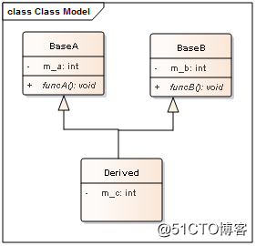
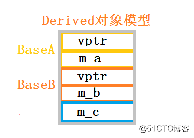
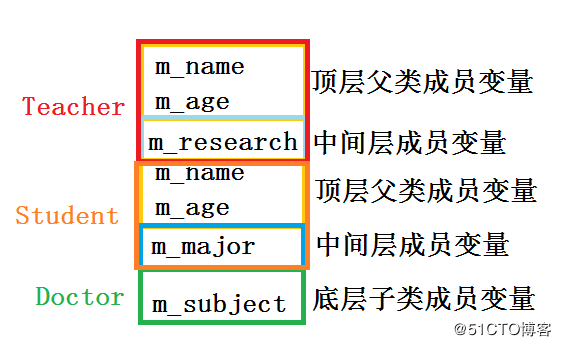

### 多继承

C++语言提供多继承的支持，多继承中派生类可以有一个以上的基类。

多继承是C++语言中**颇受争议的一项特性**，多继承在提供强大功能的同时也带来了容易造成错误的诸多不便。因此，后续很多面向对象程序设计语言取消了多继承支持，而是提供了更清晰的接口概念。
C++语言中仍然通过继承实现接口，在面向接口的编程模型，如COM，都采用多继承实现。如果需要开发一个文字处理软件，要求有些文档即可以打印有可以存储，有些文档只可以打印或存储。考虑到程序的可扩展性，比较好的设计是将打印和存储分别定义为两个接口，在接口中定义相应的方法。当一个类实现了打印和存储接口时，其对象即可以打印也可以存储。如果只实现了打印或存储，则只具备相应的功能。

```c++
#include <iostream>
#include <string>

using namespace std;

class BaseA
{
public:
    BaseA(int a)
    {
        m_a = a;
    }
    virtual void funcA()
    {
        cout << "BaseA::funcA()" <<endl;
    }
private:
    int m_a;
};

class BaseB
{
public:
    BaseB(int b)
    {
        m_b = b;
    }
    virtual void funcB()
    {
        cout << "BaseB::funcB()" <<endl;
    }
private:
    int m_b;
};

class Derived : public BaseA, public BaseB
{
public:
    Derived(int a, int b, int c):BaseA(a),BaseB(b)
    {
        m_c = c;
    }
private:
    int m_c;
};

struct Test
{
    void* vptrA;
    int a;
    void* vptrB;
    int b;
    int c;
};

int main(int argc, char *argv[])
{
    cout << sizeof(Derived) << endl;
    Derived d(1,2,3);
    Test* pTest = (Test*)&d;
    cout << pTest->a <<endl;//1
    cout << pTest->b <<endl;//2
    cout << pTest->c <<endl;//3
    cout << pTest->vptrA <<endl;//
    cout << pTest->vptrB <<endl;//
   
    return 0;
}
```

上述代码中，Derived类继承自BaseA和BaseB类，funcA和funcB为虚函数。

Derived派生类对象的内存模型如下：

创建派生类时，首先需要创建基类的对象。由于多继承一个派生类中有多个基类，因此，创建基类的对象时要遵循一定的顺序，**其顺序由派生类声明时决定**，如果将Derived类的声明修改为：
`class Derived : public BaseB, public BaseA`
基类对象BaseB会被首先创建，BaseA对象其次被创建。基类对象销毁的顺序与创建的顺序相反。
多继承会引入很多复杂问题，菱形继承时很典型的一种。

菱形继承示例代码如下：

```c++
#include <iostream>
#include <string>

using namespace std;

class People
{
public:
    People(string name, int age)
    {
        m_name = name;
        m_age = age;
    }
    void print()
    {
        cout << "name: " << m_name
             << " age: " << m_age <<endl;
    }
private:
    string m_name;
    int m_age;
};

class Teacher : public People
{
    string m_research;
public:
    Teacher(string name, int age, string research):People(name + "_1", age + 1)
    {
        m_research = research;
    }
};

class Student : public People
{
    string m_major;
public:
    Student(string name, int age,string major):People(name + "_2", age + 2)
    {
        m_major = major;
    }
};

class Doctor : public Teacher, public Student
{
    string m_subject;
public:
    Doctor(string name, int age,string research, string major, string subject):
        Teacher(name, age,research),Student(name, age, major)
    {
        m_subject = subject;
    }
};

struct Test
{
    string name1;
    int age1;
    string research;
    string name2;
    int age2;
    string major;
    string subject;
};

int main(int argc, char *argv[])
{
    Doctor doc("Bauer", 30, "Computer", "Computer Engneering", "HPC");
    cout << "Doctor size: " << sizeof(doc) << endl;
    Test* pTest = (Test*)&doc;
    cout << pTest->name1 << endl;
    cout << pTest->age1 << endl;
    cout << pTest->research << endl;
    cout << pTest->name2 << endl;
    cout << pTest->age2 << endl;
    cout << pTest->major << endl;
    cout << pTest->subject << endl;

    return 0;
}
// output:
// Doctor size: 28
// Bauer_1
// 31
// Computer
// Bauer_2
// 32
// Computer Engneering
// HPC
```

上述代码中，底层子类对象的内存局部如下：



```c++
		People

 Teacher		Student
        
		Doctor
```


底层子类对象中，分别继承了中间层父类从顶层父类继承而来的成员变量，**因此内存模型中含有两份底层父类的成员变量**。

**如果顶层父类含有虚函数，中间层父类会分别继承顶层父类的虚函数表指针**，因此，底层子类对象内存布局如下：


**虚继承**是解决C++多重继承问题的一种手段，虚继承的底层实现原理与C++编译器相关，一般通过**虚基类指针和虚基类表**实现，每个虚继承的子类都有一个虚基类指针（占用一个指针的存储空间，4（8）字节）和虚基类表（不占用类对象的存储空间）（**虚基类依旧会在子类里面存在拷贝，只是仅仅最多存在一份**）；当虚继承的子类被当做父类继承时，虚基类指针也会被继承。

**在虚继承情况下，底层子类对象的布局不同于普通继承，需要多出一个指向中间层父类对象的虚基类表指针vbptr。**
vbptr是虚基类表指针（virtual base table pointer），vbptr指针指向一个虚基类表（virtual table），**虚基类表存储了虚基类相对直接继承类的偏移地址**；通过偏移地址可以找到虚基类成员，虚继承不用像普通多继承维持着公共基类（虚基类）的两份同样的拷贝，节省了存储空间。


```c++
#include <iostream>
#include <string>

using namespace std;

class People
{
public:
    People(string name, int age)
    {
        m_name = name;
        m_age = age;
    }
    void print()
    {
        cout << "this: " << this <<endl;
    }
private:
    string m_name;
    int m_age;
};

class Teacher : virtual public People
{
    string m_research;
public:
    Teacher(string name, int age, string research):People(name + "_1", age + 1)
    {
        m_research = research;
    }
    void print()
    {
        cout << "this: " << this <<endl;
    }
};

class Student : virtual public People
{
    string m_major;
public:
    Student(string name, int age,string major):People(name + "_2", age + 2)
    {
        m_major = major;
    }
    void print()
    {
        cout << "this: " << this <<endl;
    }
};

class Doctor : public Teacher, public Student
{
    string m_subject;
public:
    Doctor(string name, int age,string research, string major, string subject):
        People(name, age),Teacher(name, age,research),Student(name, age, major)
    {
        m_subject = subject;
    }
};

struct Test
{
    void* vbptr_left;
    string research;
    void* vbptr_right;
    string major;
    string subject;
    string name;
    int age;
};

int main(int argc, char *argv[])
{
    Doctor doc("Bauer", 30, "Computer", "Computer Engneering", "HPC");
    cout << "Doctor size: " << sizeof(doc) << endl;
    Test* pTest = (Test*)&doc;
    cout << pTest->vbptr_left << endl;
    cout << *(int*)pTest->vbptr_left << endl;
    cout << pTest->research << endl;
    cout << pTest->vbptr_right << endl;
    cout << *(int*)pTest->vbptr_right << endl;
    cout << pTest->major << endl;
    cout << pTest->subject << endl;
    cout << pTest->name << endl;
    cout << pTest->age << endl;

    return 0;
}

// output:
// Doctor size: 28
// 0x40539c
// 12
// Computer
// 0x4053a8
// 0
// Computer Engneering
// HPC
// Bauer
// 30
```

