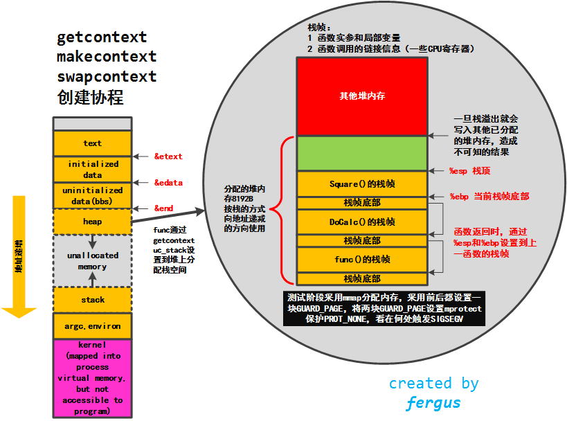

# ucontext簇函数学习  
系统手册学习： 
-----------   

## 名字  

**getcontext**, **setcontext** —— 获取或者设置用户上下文

## 概要  


```c
#include <ucontext.h>

int getcontext(ucontext_t *ucp);
int setcontext(const ucontext_t *ucp);
```
## 描述  

在类**System-V**环境中，定义在```<ucontext.h>```头文件中的**mcontext_t**和**ucontext_t**的两种数据类型，以及**getcontext()**，**setcontext()**，**makecontext()**和**swapcontext()**四个函数允许在一个进程不同的协程中用户级别的上下文切换。  
**mcontext_t**数据结构是依赖机器和不透明的。**ucontext_t**数据结构至少包含下面的字段：  

```c
typedef struct ucontext {
    struct ucontext *uc_link;
    sigset_t         uc_sigmask;
    stack_t          uc_stack;
    mcontext_t       uc_mcontext;
    ...
} ucontext_t;
```
**sigset_t**和**stack_t**定义在```<signal.h>```头文件中。**uc_link**指向当前的上下文结束时要恢复到的上下文（只在当前上下文是由**makecontext**创建时，个人理解：只有makecontext创建新函数上下文时需要修改），**uc_sigmask**表示这个上下文要阻塞的信号集合（参见**sigprocmask**），**uc_stack**是这个上下文使用的栈（个人理解：非**makecontext**创建的上下文不要修改），**uc_mcontext**是机器特定的保存上下文的表示，包括调用协程的机器寄存器。  
**getcontext()**函数初始化**ucp**所指向的结构体，填充当前有效的上下文。  
**setcontext()**函数恢复用户上下文为**ucp**所指向的上下文。成功调用不会返回。**ucp**所指向的上下文应该是**getcontext()**或者**makeontext()**产生的。  
如果上下文是**getcontext()**产生的，切换到该上下文，程序的执行在**getcontext()**后继续执行。  
如果上下文被**makecontext()**产生的，切换到该上下文，程序的执行切换到**makecontext()**调用所指定的第二个参数的函数上。当该函数返回时，我们继续传入**makecontext()**中的第一个参数的上下文中**uc_link**所指向的上下文。如果是NULL，程序结束。  

## 返回值    

成功时，**getcontext()**返回0，**setcontext()**不返回。错误时，都返回-1并且赋值合适的errno。  

## 注意  

这个机制最早的化身是**setjmp/longjmp**机制。但是它们没有定义处理信号的上下文，下一步就出了**sigsetjmp/siglongjmp**。当前这套机制给予了更多的控制权。但是另一方面，没有简单的方法去探明**getcontext()**的返回是第一次调用还是通过**setcontext()**调用。用户不得不发明一套他自己的书签的数据，并且当寄存器恢复时，register声明的变量不会恢复（寄存器变量）。  
当信号发生时，当前的用户上下文被保存，一个新的内核为信号处理器产生的上下文被创建。不要在信号处理器中使用**longjmp**:它是未定义的行为。使用**siglongjmp()**或者**setcontext()**替代。  

## 名字  

**makecontext**，**swapcontext** —— 操控用户上下文  

## 概要  


```c
#include <ucontext.h>

void makecontext(ucontext_t *ucp, void (*func)(void), int argc, ...);
int swapcontext(ucontext_t *restrict oucp, const ucontext_t *restrict ucp);
```
## 描述  

**makecontext()**函数修改**ucp**所指向的上下文，**ucp**是被**getcontext()**所初始化的上下文。当这个上下文采用**swapcontext()**或者**setcontext()**被恢复，程序的执行会切换到**func**的调用，通过**makecontext()**调用的**argc**传递**func**的参数。  
在**makecontext()**产生一个调用前，应用程序必须确保上下文的栈分配已经被修改。应用程序应该确保**argc**的值跟传入**func**的一样（参数都是int值4字节）；否则会发生未定义行为。  
当**makecontext()**修改过的上下文返回时，**uc_link**用来决定上下文是否要被恢复。应用程序需要在调用**makecontext()**前初始化**uc_link**。  
**swapcontext()**函数保存当前的上下文到**oucp**所指向的数据结构，并且设置到**ucp**所指向的上下文。   

## 返回值  

成功完成，**swapcontext()**返回0。否则返回-1，并赋值合适的errno。  

## 错误

**swapcontext()**函数可能会因为下面的原因失败：  
**ENOMEM** **ucp**参数没有足够的栈空间去完成操作。  

## 例子  


```c
#include <stdio.h>
#include <ucontext.h>


static ucontext_t ctx[3];


static void
f1 (void)
{
    puts("start f1");
    swapcontext(&ctx[1], &ctx[2]);
    puts("finish f1");
}


static void
f2 (void)
{
    puts("start f2");
    swapcontext(&ctx[2], &ctx[1]);
    puts("finish f2");
}


int
main (void)
{
    char st1[8192];
    char st2[8192];


    getcontext(&ctx[1]);
    ctx[1].uc_stack.ss_sp = st1;
    ctx[1].uc_stack.ss_size = sizeof st1;
    ctx[1].uc_link = &ctx[0];
    makecontext(&ctx[1], f1, 0);


    getcontext(&ctx[2]);
    ctx[2].uc_stack.ss_sp = st2;
    ctx[2].uc_stack.ss_size = sizeof st2;
    ctx[2].uc_link = &ctx[1];
    makecontext(&ctx[2], f2, 0);


    swapcontext(&ctx[0], &ctx[2]);
    return 0;
}
```

代码试用总结：  
-----------   
- 1 makecontext之前必须调用getcontext初始化context，否则会段错误core  
- 2 makecontext之前必须给uc_stack分配栈空间，否则也会段错误core  
- 3 makecontext之前如果需要上下文恢复到调用前，则必须设置uc_link以及通过swapcontext进行切换  
- 4 getcontext产生的context为当前整个程序的context，而makecontext切换到的context为新函数独立的context，但setcontext切换到getcontext的context时，getcontext所在的函数退出时，并不需要uc_link的管理，依赖于该函数是在哪被调用的，整个栈会向调用者层层剥离   
- 5 不产生新函数的上下文切换指需要用到getcontext和setcontext  
- 6 产生新函数的上下文切换需要用到getcontext，makecontext和swapcontext  


ucontext性能小试：  
-----------   
运行环境为我的mac下通过虚拟机开启的centos64位系统，不代表一般情况，正常在linux实体机上应该会好很多吧  

- 1 单纯的getcontext:  
function[ **getcontext(&ctx)** ] count[ **10000000** ]  
cost[ **1394.88** ms] avg_cost[ **0.14** us]  
total CPU time[ **1380.00** ms] avg[ **0.14** us]  
user CPU time[ **560.00** ms] avg[ **0.06** us]  
system CPU time[ **820.00** ms] avg[ **0.08** us]  

- 2 新函数的协程调用  
通过getcontext和对uc_link以及uc_stack赋值，未了不增加其他额外开销，uc_stack为静态字符串数组分配，运行时不申请，makecontext中的函数foo为空函数，调用swapcontext切换协程调用测试  
function[ **getcontext_makecontext_swapcontext()** ] count[ **1000000** ]  
cost[ **544.55** ms] avg_cost[ **0.54** us]  
total CPU time[ **550.00** ms] avg[ **0.55** us]  
user CPU time[ **280.00** ms] avg[ **0.28** us]  
system CPU time[ **270.00** ms] avg[ **0.27** us]  

每秒**百万级别**的调用性能。  

ucontext协程的实际使用：  
-----------   
将getcontext，makecontext，swapcontext封装成一个类似于lua的协同式协程，需要代码中主动yield释放出CPU。  
协程的栈采用malloc进行堆分配，分配后的空间在64位系统中和栈的使用一致，地址递减使用，uc_stack.uc_size设置的大小好像并没有多少实际作用，使用中一旦超过已分配的堆大小，会继续向地址小的方向的堆去使用，这个时候就会造成堆内存的越界使用，更改之前在堆上分配的数据，造成各种不可预测的行为，coredump后也找不到实际原因。  
对使用协程函数的栈大小的预估，协程函数中调用其他所有的api的中的局部变量的开销都会分配到申请给协程使用的内存上，会有一些不可预知的变量，比如调用第三方API，第三方API中有非常大的变量，实际使用过程中开始时可以采用mmap分配内存，对分配的内存设置GUARD_PAGE进行mprotect保护，对于内存溢出，准确判断位置，适当调整需要分配的栈大小。  
  