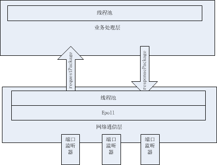
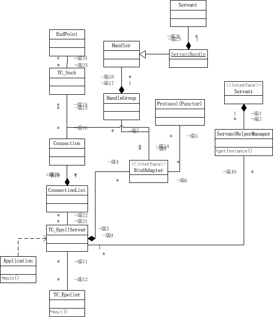

这是在沐瞳一面的时候，面试官给我安利了，一个就是公司一般网络层是保密的，初级程序员进来就是写逻辑的，看不到网络层，自然需要进行业务和底层网络通信分离好吧。


### 业务与底层网络通信分离

Server大部分主要分为两层：

* 网络接收层：负责监听端口，负责收包，编码，解码工作，负责将响应包回传给客户端。
* 业务处理层：负责接收网络接收层完整的包，如果是RPCserver，则需要根据上下文请求（由网络接收层构建）中指定的方法名以及参数调用指定服务（需要有完善的异常处理机制），得到响应包，通过网络接收层编码回传给客户端。
  



### TAF server的大致组件结构

* Application：服务需要自行继承该App，代表了一个服务应用。
* EpollServer：实现底层的Epoll网络监听模型以及adapter的注册管理等工作，监听多个端口。
* Epoller:负责Epoll底层实现细节。
* BindApapter：代表一个网络端口的监听，将具体的网络底层处理委托给EpollServer，拥有自己的协议编解码器和业务处理器。
* Protocol：是一个仿函数，表示编码解码具体的协议，可自定义，挂载到Adapter上面。
* ServantHandler：负责将请求交给具体的业务逻辑servant处理，通常接收编解码后的请求包（上下文），挂载到Adapter上。
* ServantHelperManager：是一个单例类，主要用来管理servant类与名字的对应关系，管理adapterName与servant的对应关系。以供EpollServer决定将请求分发给哪一个Adapter处理。
* Servant：表示具体的服务接口，具体业务具体实现。



Application代表一个应用，我们自己实现的Server继承自此类，自定义初始化操作，并调用main启动，操作包括：

1. 忽略PIPE信号。
2. 解析应用部署时自动生成的配置文件：解析配置文件。首先根据命令行参数构建一个TC_Option，获取参数--config获取配置文件路径，保存在ServerConfig :: ConfigFile变量中,利用TC_Config解析配置文件，并将配置加载到Application::conf的静态变量中。
3. 初始化客户端部分；
4. 初始化服务端部分。
5. 绑定业务servant的adapter到EpollServer中。
6. 初始化业务应用。
7. 设置HandleGroup分组，启动线程。
8. 启动业务处理线程。
9. 恢复BUS连接。
10. 动态加载配置文件
11. 动态设置滚动日志等级
12. 动态设置按天日志等级
13. 查看服务状态
14. 查看当前链接状态
15. 查看编译的TAF版本
16. 加载配置文件中的属性信息
17. 查看服务支持的管理命令
18. 设置染色信息
19. 上报版本
20. 发送心跳给node, 表示启动了
21. 发送给notify表示服务启动了
22. ctrl + c能够完美结束服务
23. 重定向 stdin、stdout、 stderr
24. 初始化完毕后, 日志再修改为异步
    

```c++
void  Application::main( int  argc,  char  *argv[])
{
     try
    {
         TC_Common ::ignorePipe();

         //解析配置文件
        parseConfig(argc, argv);

         //初始化Proxy部分
        initializeClient();

         //初始化Server部分
        initializeServer();

        vector< TC_EpollServer  :: BindAdapterPtr  > adapters;

         //绑定对象和端口
        bindAdapter(adapters);

         //业务应用的初始化
        initialize();

         //输出所有adapter
        outAllAdapter(cout);

         //设置HandleGroup分组，启动线程
         for  (size_t i = 0; i < adapters.size(); ++i)
        {
            string name = adapters[i]->getName();

            string groupName = adapters[i]->getHandleGroupName();

             if (name != groupName)
            {
                 TC_EpollServer ::  BindAdapterPtr  ptr =  _epollServer ->getBindAdapter(groupName);

                 if  (!ptr)
                {
                     throw  runtime_error( "[TAF][adater `"  + name +  "` setHandle to group `"  + groupName +  "` fail!"  );
                }

            }
            setHandle(adapters[i]);

             /*
            if (name == groupName)
            {
                setHandle(adapters[i]);

                continue;
            }

            TC_EpollServer::BindAdapterPtr ptr = _epollServer->getBindAdapter(groupName);

            if (! ptr)
            {
                throw runtime_error("[TAF][ adater `" + name + "` setHandle to group `" + groupName + "` fail!");
            }

            adapters[i]->setHandle( ptr);
            */
        }

         //启动业务处理线程
         _epollServer ->startHandle();
             _epollServer ->createEpoll();
             //恢复BUS连接
cout <<  "begin BusConnectRecover"  << endl;
           BusConnectRecover();
cout <<  "end BusConnectRecover"  << endl;

        cout <<  "\n"  << outfill( "[initialize server] " ,  '.' )  <<  " [Done]"  << endl;

        cout << OUT_LINE_LONG << endl;

         //动态加载配置文件
        TAF_ADD_ADMIN_CMD_PREFIX(TAF_CMD_LOAD_CONFIG,  Application ::cmdLoadConfig);

         //动态设置滚动日志等级
        TAF_ADD_ADMIN_CMD_PREFIX(TAF_CMD_SET_LOG_LEVEL,  Application ::cmdSetLogLevel);

             //动态设置按天日志等级
            TAF_ADD_ADMIN_CMD_PREFIX(TAF_CMD_SET_DAYLOG_LEVEL,  Application ::cmdEnableDayLog);

         //查看服务状态
        TAF_ADD_ADMIN_CMD_PREFIX(TAF_CMD_VIEW_STATUS,  Application ::cmdViewStatus);

         //查看当前链接状态
        TAF_ADD_ADMIN_CMD_PREFIX(TAF_CMD_CONNECTIONS,  Application ::cmdConnections);

         //查看编译的TAF版本
        TAF_ADD_ADMIN_CMD_PREFIX(TAF_CMD_VIEW_VERSION,  Application ::cmdViewVersion);

         //加载配置文件中的属性信息
        TAF_ADD_ADMIN_CMD_PREFIX(TAF_CMD_LOAD_PROPERTY,  Application ::cmdLoadProperty);

         //查看服务支持的管理命令
        TAF_ADD_ADMIN_CMD_PREFIX(TAF_CMD_VIEW_ADMIN_COMMANDS,  Application ::cmdViewAdminCommands);

         //设置染色信息
        TAF_ADD_ADMIN_CMD_PREFIX(TAF_CMD_SET_DYEING,  Application ::cmdSetDyeing);

        TAF_ADD_ADMIN_CMD_PREFIX(TAF_CMD_CLOSE_CORE,  Application ::cmdCloseCoreDump);
         //上报版本
        TAF_REPORTVERSION(TAF_VERSION);

         //发送心跳给node, 表示启动了
        TAF_KEEPALIVE( ""  );

         //发送给notify表示服务启动了
         TafRemoteNotify ::getInstance()->report(  "restart" );

         //ctrl + c能够完美结束服务
        signal(SIGINT, sighandler);


         if (  _conf . get( "/ taf/application/server<closecout>" ,  AppCache :: getInstance()->get ( "closeCout"  )) !=  "0"  )
        {
             // 重定向stdin、stdout、 stderr
             int  fd = open( "/dev/null"  , O_RDWR );
             if (fd != -1)
            {
               dup2(fd, 0);
               dup2(fd, 1);
               dup2(fd, 2);
            }
             else
            {
               close(0);
               close(1);
               close(2);
            }
        }
    }
     catch  (exception &ex)
    {
         TafRemoteNotify ::getInstance()->report(  "exit: "  + string(ex.what ()));

        cout <<  "[main exception]:"  << ex.what() << endl;

        terminate();
    }

     //初始化完毕后, 日志再修改为异步
     TafRollLogger ::getInstance()->sync( false );
}
```


接下来，我们分析其中的一些关键步骤。

#### (1)忽略PIPE信号(多处提及了)

为何需要忽略PIPE信号呢？ 对一个对端已经关闭的socket调用两次write, 第二次将会生成SIGPIPE信号, 该信号默认结束进程. 具体的分析可以结合TCP的"四次握手"关闭. TCP是全双工的信道, 可以看作两条单工信道, TCP连接两端的两个端点各负责一条. 当对端调用close时, 虽然本意是关闭整个两条信道, 但本端只是收到FIN包. 按照TCP协议的语义, 表示对端只是关闭了其所负责的那一条单工信道, 仍然可以继续接收数据. 也就是说, 因为TCP协议的限制, 一个端点无法获知对端的socket是调用了close还是shutdown. 对一个已经收到FIN包的socket调用read方法, 如果接收缓冲已空, 则返回0, 这就是常说的表示连接关闭. 但第一次对其调用write方法时, 如果发送缓冲没问题, 会返回正确写入(发送). 但发送的报文会导致对端发送RST报文, 因为对端的socket已经调用了close, 完全关闭, 既不发送, 也不接收数据. 所以, 第二次调用write方法(假设在收到RST之后), 会生成SIGPIPE信号, 导致进程退出. 为了避免进程退出, 可以捕获SIGPIPE信号, 或者忽略它, 给它设置SIG_IGN信号处理函数:
signal(SIGPIPE, SIG_IGN);
这样, 第二次调用write方法时, 会返回-1, 同时errno置为SIGPIPE. 程序便能知道对端已经关闭.
在linux下写socket的程序的时候，如果尝试send到一个disconnected socket上，就会让底层抛出一个SIGPIPE信号。
这个信号的缺省处理方法是退出进程，大多数时候这都不是我们期望的。因此我们需要重载这个信号的处理方法。调用以下代码，即可安全的屏蔽SIGPIPE：
`signal （SIGPIPE， SIG_IGN）；`
对于产生信号，我们可以在产生信号前利用方法 `signal(int signum, sighandler_t handler)` 设置信号的处理。如果没有调用此方法，系统就会调用默认处理方法：中止程序，显示提示信息(就是我们经常遇到的问题)。我们可以调用系统的处理方法，也可以自定义处理方法。 

系统里边定义了三种处理方法： 


* SIG_DFL信号专用的默认动作:
    (a)如果默认动作是暂停线程，则该线程的执行被暂时挂起。当线程暂停期间，发送给线程的任何附加信号都不交付，直到该线程开始执行，但是SIGKILL除外。
    (b)把挂起信号的信号动作设置成SIG_DFL，且其默认动作是忽略信号 (SIGCHLD)。

* SIG_IGN忽略信号
    (a)该信号的交付对线程没有影响
    (b)系统不允许把SIGKILL或SIGTOP信号的动作设置为SIG_DFL

* SIG_ERR   

  ```c
  void  TC_Common::ignorePipe()
  {
       struct  sigaction  sig;
  
      sig.sa_handler = SIG_IGN;
      sig.sa_flags = 0;
      sigemptyset (&sig.sa_mask);
       sigaction (SIGPIPE,&sig,NULL);
  }
  ```

  

(3)中是获取配置文件的default属性，利用 CommunicatorFactory 构建 communicator， 初始化通信器。

省略以下一万字：https://blog.csdn.net/turkeyzhou/article/details/8759530


