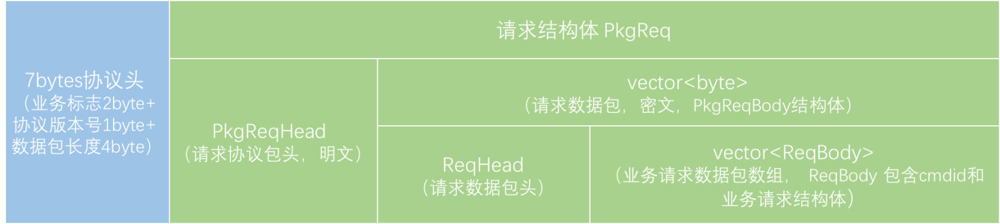
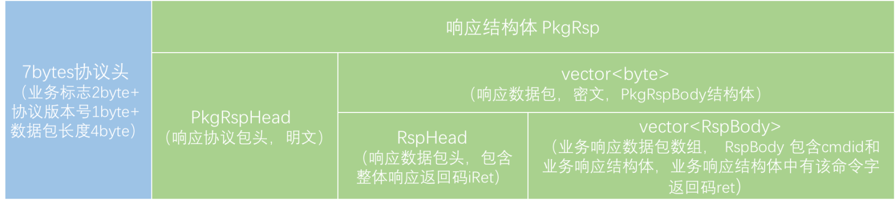
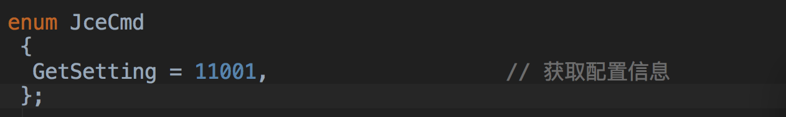
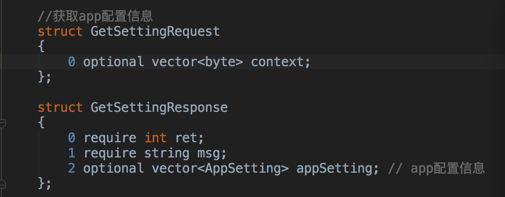

# App与后台通信：从文本协议到二进制协议

**App与后台通信通常有采用json等文本协议或者采用二进制协议，本文则主要总结了心悦俱乐部App的接入层从文本协议到二进制jce协议迭代过程中的技术方案，包括协议规范、安全性等方面的内容。**

# 背景

   在移动客户端开发中，基本都会需要与服务端进行数据交互。对于一般的App来说，通过http请求，采用json格式的文本协议进行数据通信也就基本满足需求了。在业务不断增加，用户体量不断增长之后，对用户体验的要求也越来越高。对于需要进行频繁网络请求的App来说，提高网络传输性能则是提高App响应速度，优化用户体验的重要手段。因此往往会引入二进制协议，来减小数据包。本文则主要总结了心悦俱乐部App的接入层从文本协议到二进制jce协议迭代过程中的技术方案，包括协议规范、安全性等方面的内容。

# 文本协议方案

在http的数据请求中，一般会采用json或者xml形式的文本协议。特别是对于App或者web端的前后台交互更多的会采用json格式，数据量相对xml较小，协议字段可以增删改，比较灵活。

心悦App在前期，Native模块与内嵌H5和WEB管理端使用的都是统一的PHP框架后台，采用的是http+json的文本协议接入层。

## 请求与响应

   App网络层发起http请求时，一般会对http header做一些定制修改，来传递一些通用数据，通常会在[User-Agent](https://developer.mozilla.org/en-US/docs/Web/HTTP/Content_negotiation#The_User-Agent.3a_header)写入一些App和手机的信息，例如操作系统版本、机型、App版本等等，在cookie中写入登录态。

```javascript
例如：User-Agent：tgclub/4.1.0.63(OPPO R7;android 4.4.4;Scale/480;android;868979027609987)
```

   在文本协议方案中，不同的网络请求可以由不同的请求路径区分，路径格式如下：

```
    http://xxx.xxx.com/xyapp/api/{mod}/{act}?c_ver={version}
    version:协议版本号, 默认当前版本号码为1.0
    mod:模块名称
    act:动作名称
```

   如，获取游戏信息,接口名称为 game/get_game_info，地址为：`http://xxx.xx.com/xyapp/api/game/get_game_info`

   请求响应数据都包含在返回的JSON中，按照与后台定义好的协议字段返回。一般建议包括本次操作的返回码、错误码和具体的业务数据。心悦App的响应 JSON 中，包含字段有： - status 返回码，1成功 0失败 - data 返回业务数据，当发生内部错误时，会返回字段errcode，例如

```javascript
{"status":0,"errcode":10002,"data":"签名校验错误"}：
```

   可以看到，虽然json数据的格式已经很简洁了，但它依然把属性名称，比如 status和data， 以及大括号，引号这些用于表示数据格式的信息也进行传输了，数据存在较多冗余。

## 安全性

   由于文本协议结构清晰、意义明确，所以方便解读，但也存在较大的安全风险。对于App后台服务来说，也容易存在API泄漏，第三方客户端伪造访问服务器对我们的服务或者流程造成安全危害。因此需要一定的安全校验和加密措施。

   首先，**接入层要验证请求的合法性**，心悦App文本协议方案中采用的是校验**签名**的方式来验证发来的请求是否来自官方客户端和是否有效。

   HTTP调用需以GET形式传递一下两个参数：`签名参数(sn)和时间戳(time_st)`。

  签名参数的生成方式：首先对http请求中的所有参数按照参数名的字典顺序排序，参数名和参数值拼接成字符串，再用每个设备独有的签名密钥sn_key对该字符串取md5值得到签名参数(sn)的值。其中签名密钥sn_key，由后台根据用户设备id生成，通过签名注册接口从服务器获取，后台和客户端分别存储。签名注册接口则用预先与App约定好的初始密钥进行签名校验，保证签名安全性。签名的参数包括所有的get参数和post参数。后台收到客户端请求后用同样的签名方式计算sn参数，与请求中的参数一致才对请求进行处理。此外，对于时间戳参数，服务器会拒绝一定时间范围之外的请求，防止请求重放攻击。

例如请求request为：`?param_b=1&param_a=2&time_st=123，sn_key=aaa`

那么签名参数`sn = md5('param_a2param_b1time_st123aaa')`

   **其次，若要保证请求数据中的敏感内容不被泄露**，需要对文本协议内容进行加密传输活采用https协议。在心悦App的文本协议方案中，采用的是对请求数据进行CBC模式的AES加密。**AES加密是一种对称加密算法**，同一个密钥可以同时用作信息的加密和解密。**加密密钥pub_key可以通过签名注册接口和sn_key一并返回**，后台和客户端分别存储pub_key用于加密解密。签名注册接口可以使用客户端和服务器约定初始密钥加密解密，并且这个密钥只在签名注册接口用一次。

   经过签名校验和数据加密之后，基本上可以保证文本协议网络请求的安全性。

# 二进制协议方案

   二进制协议在网络传输中也有广泛使用，具体的协议也有很多，例如公司自研的jce协议，谷歌的Protocol buffer等等。

   为优化App的网络请求速度和减小数据包大小，并配合接入层后台往C++框架改造，心悦App的接入层网络数据传输协议切换成了二进制协议。协议数据包的定义统一采用**协议头+业务包体**(协议内容)的方式，协议头中用若干比特位定义协议版本号、数据包长度等信息。

## 请求与响应

在二进制协议方案中，不同的网络请求使用同一域名，后台根据请求结构体中的命令字参数进行路由转发。由于客户端的数据集合需求比较多样，后台则一般为服务化接口，因此需要支持多命令字请求合并，数据一并返回。此外，为进一步减小网络传输数据包，协议可以考虑进行**压缩**，同时为保证[数据安全](https://cloud.tencent.com/solution/data_protection?from=10680)性，**数据加密**也必不可少。综上，心悦App在进行二进制协议改造时，制定了如下格式的二进制协议格式：

请求协议



响应协议



  请求协议的协议头中包含业务标志、协议版本号和数据包长度，服务端只处理以业务标志开头的数据包。截取协议头后，用PkgReq结构体解析协议头中指定长度的数据包。PkgReq包括明文的协议包头PkgReqHead和密文的二进制流。PkgReqHead中会包括客户端生成的请求序列号，密文的加密方式、压缩方式等信息，用这些信息解开加密压缩过的PkgReqBody。PkgReqBody包含通用请求数据ReqHead和业务请求数据ReqBody数组。ReqHead中主要包括用户的设备信息、App版本信息、账号信息、网络环境等等基础信息，ReqBody则是具体请求命令字和业务请求结构体的封装。若是多个命令字的合并请求则会有多个ReqBody，而ReqHead只需要有一份。后台路由层根据ReqBody中的命令字cmdid将ReqBody中的businessReqBody字段转发到具体的后台服务进行处理。并且ReqHead中设计了guid字段，后台会存储用户的设备信息并且给用户分配唯一的guid，客户端拿到guid之后，后续的请求就不需要上报不变的设备信息字段，只需要上传guid，后端可以根据guid按需获取用户设备信息，减小请求数据量。

响应协议与请求协议的整体结构类似，由于响应需要返回错误码或返回码给客户端，并且存在合并请求，因此设计了两层返回码。在RspHead中有整体返回码iRet，作为路由层整体的处理结果；每个RspBody中还有ret，作为该命令字对应的后台服务的返回结果。每个RspBody中的businessRspBody在iRet和ret同时有效时才能用该命令字对应的响应结构体进行解包。

此外，命令字需要定义在枚举中，命令字命名与协议中业务请求结构体和业务响应结构体命名保持对称，如GetSettingRequest对应GetSettingResponse，命令字为命令字为GetSetting=1001，便于用命令字进行反射匹配出请求和响应。具体的Request结构体和Response结构体示例：





## 安全性

​    二进制协议方案与文本协议方案类似，都需要考虑数据安全性的问题。二进制协议由于传输的数据包是二进制流，抓包并不能直接看到结构体，例如我们采用的jce协议，必须知道完整的数据格式才能解析出原始数据。在我们的方案中还采用了https、对协议中的内容数据PkgReqBody/PkgRspBody进行先压缩后加密等操作保证安全性。

​    在心悦App的二进制协议方案中，采用的也是AES加密，与文本协议不同的是采用AES的GCM模式。AES作为一种分组对称加密算法，需要对明文进行分组，分组长度可为128或256bits，有ECB，CBC，CTR等多种模式，这里不做具体介绍。GCM模式可以提供对消息的加密和完整性校验，具体原理这里不作详细介绍，可以参考文章 [什么是 AES-GCM加密算法](http://blog.csdn.net/t0mato_/article/details/53160772)。AES-GCM加密也需要密钥key、初始向量iv，并且加密之后除了得到密文，还会得到消息校验码。在数据接收方可以通过这个校验码校验密文是否有篡改。在具体实现中，为增强安全性，iv由请求序列号和key按照一定规则动态生成，并将加密得到的校验码填写在协议包头PkgReqHead/PkgRspHead中，在解密时需要作为验证条件。

​    在安卓客户端，对数据进行加密、压缩的操作封装在了NDK代码中，通过提供so库的方式给Java层调用，并且校验App签名、应用包名，防止反编译，可以进一步保证了安全性。

# 小结

​    对于App和后台接入层的数据交互，不管是长链接还是短链接，其数据协议都可以存在文本协议和二进制协议两种类型。文本协议直观、描述性强，容易理解、便与调试，并且协议修改方便，但是数据冗余较多，安全性稍差；二进制协议格式精简、冗余数据少，窃听成本更高，但是数据不直观、调试略微复杂，使用、升级维护都需要约定好规则，各有优劣，因此可以根据不同的使用场景确定不同的方案。