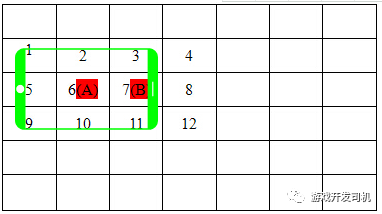

#### 游戏服务器如何计算一个用户视野范围所有玩家，记录动作，尽可能快地响应给客户？

祖龙之前也问过这个问题，记得是划分网格

### 游戏服务器架构：MMO手游地图9宫格同步方案

提到了大地图分割和同步方式，我个人比较熟悉地图9宫格同步方式。

在MMO游戏里，玩家要能看到地图上所有角色的行为，这就需要将其它玩家的动作都通过网络数据同步过来。同步一般使用9宫格来确定，哪些玩家的数据要同步过来，然后自己的行为要同步给哪些玩家。

服务器大格子的大小，以3*3的格子要总比客户端显示范围要大一点为原则。比客户端大一点，是为了预留资源加载的时间。

如下图所示，绿色表示手机客户端的显示区域，当角色A在格子6中时，他可以看到1,2,3,5,6,7,9,10,11这9个格子里的内容，那么当他的状态发生变化时，就需要同步给在这9个格子里的所有玩家；同样，当这9个格子里的有玩家或者怪物的状态改变时，也需要都同步给角色A。

当角色A移动到角色B所在的格子(7)，则他将不再看到1,5,9这三个格子里的内容（玩家和怪物），同时他将新看到4,8,12这三个格子里的地图内容。所以这个过程中，服务器要下发消息，删除角色A所在的客户端里的1,5,9这三个格子里的地图内容，同时下发消息新增4,8,12这三个格子里的地图内容（类型一）。

推荐大格子具体的大小，按客户端iPhone4S的960\*640分辨来制定，取屏幕长宽的1/2大一些，可以定为640*360。

**3. 角色的移动同步**

地图上角色的同步可以分为位移的同步和行为（比如放技能）的同步。这里主要讨论位移的同步方式。

位移同步的目的是为了将自己的位置变化发给服务器，然后由服务器通过9宫格的方式转发给周围的其他玩家。

有的端游是以客户端格子的基本单位进行同步，当玩家从一个格子移动到了另一个格子时，就发消息通知给服务器。这种方式的缺点就是：

- **一、同步的延迟。玩家从一个格子开始移动，移动到另一个格子后，才发消息给服务器，服务器再转发给其它客户端，那其它客户端的玩家位置，总会有一点延后。**
- **二、当网络不稳定的时候，很容易看到其它玩家不是均速的移动，比如玩家位置没动，然后一下子瞬移到了下一个格子。**

我们采用的方式，是同步状态的变化，然后由客户端来触发服务器对大格子跨越的判断：

>  当玩家点击地图上某个地方，或者改变了摇杆方向，玩家的运行状态就变化了，即向某个坐标点移动。状态变化的时候，客户端就立即给服务器发消息，然后服务器进行转发。这样如果忽略了网络的延迟，那这个角色在所有客户端上，几乎是同时开始移动。        如果移动过程中没有其它变化，则整个移动过程中只有一次消息同步。这里需要处理一个问题，就是服务器需要知道这个角色什么时候跨越了服务器的同步大格子，当角色跨越了同步大格子时，服务器就需要进行第二节里（类型一）的操作。
>
> ​        如何判断角色的移动过程中跨越了同步大格子，有的游戏里采用服务器判断的方式，即根据角色的移动速度和方向，计算出跨越的时刻，然后使用一个Timer来触发。同时如果服务器要取这个角色的当前位置，则需要通过运动公式来进行计算。这个方案相对精确一些，但比较复杂，服务器也需要为每一个移动的角色设定一个Timer，对服务器的性能有所影响。        我们采用的方式，是由客户端判断角色每移动一小段距离，然后发消息通知服务器，服务器不对这个消息进行转发，而只是判断是否跨越了大格子，同时记录下这个坐标，作为角色的当前位置。这一小段距离可以取100左右，值取得越大时，消息发送频率越小，但服务器的同步大格子跨越判断和角色当前位置就越不精确。        因为是直接同步的运行状态，所以客户端发给服务器的坐标单位是3D坐标系里单位，而不是3D坐标系格子的坐标单位。这样就更加精确，一点点距离的移动，都能准确同步。
>
> ​        同步运动状态的一个问题是，如果玩家操作很频繁，比如快死了逃跑时，疯狂地点地图，这时运动状态变化的非常快，如果每个状态的变化都同步给服务器，再加上广播，那消息量是很大的。         所以需要设置一个状态同步的最短时间，当运动状态变化很快时，则将状态变化的消息缓存在客户端，同时加一个Timer跟踪。当马上有新的状态变化消息出来时，则进行替换，同时更新Timer。当没有状态变化的消息出来时，Timer到时间了就会触发，将缓存的状态变化的消息，发给服务器。         这样通过消息缓存加上Timer的处理，既实现了运行状态同步的最短时间限制，也保证了最后有效的运行状态会稍晚一点点发送给服务器。

**4. 怪物的同步**

怪物的同步在传统的端游里，是完全由服务器的怪物AI系统触发，客户端只是纯粹的接受服务器下发的怪物状态数据。对于手机游戏里，由于手机上很难出现像PC里那样的外挂，所以怪物的AI可以考虑放在客户端触发，同时减少怪物的状态同步。详细说明如下：

**a) 怪物的随机移动不同步**

在地图上，怪物都会有一个固定的位置。怪物没有进入战斗状态时，就会在这个固定位置的周围走来走去，随机的移动。这个随机的移动由每个客户端自己控制，这样怪物的随机移动，就不用消息广播进行同步了。

由于客户端自己控制怪物的随机走动，所以会出现不同客户端里，怪物位置不一样的问题。但由于怪物随机移动的范围较小，所以这个问题不是很明显，在手机上是可以接受的。角色打怪时，是扇形的伤害范围，所以即使怪物坐标在不同的客户端有点不一致，打怪的效果也是可以接受的。

**b) 怪物的行为同步**

当有角色攻击被动怪物，或者进入主动怪物的视野范围内时，怪物的AI就被这个角色所在的客户端锁定了，同时怪物进入攻击状态。攻击的判断完全由锁定怪物AI的客户端进行处理，同时这个客户端会将这个怪物的行为上发到服务器，由服务器广播给周围的其他玩家。

怪物的AI锁定，使用抢占式，即谁最先发消息给服务器申请怪物的AI锁定，谁就获得了怪物的控制权，直到怪物死亡或脱离战斗状态。

怪物可以每进行一次攻击，客户端就发一个消息给服务器。这样做，消息还是有点多，特别是一群怪围着几个角色进行攻击时，消息广播还是有点多。所以可以将状态的概念向上扩大，只同步怪物在攻击哪个玩家，而不同步每一次的攻击，然后由每个客户端根据怪物固定的攻击速度各自去表现。这样一个怪去攻击一个玩家，就会只有一次消息广播了。

**c) 精英怪和BOSS怪的AI**

精英怪和BOSS怪由于数量较少，而且比较重要，所以不能由客户端来申请AI控制权，而是服务器根据某种策略来控制。所使用的策略可以考虑角色的伤害值、防御值、角色与BOSS的距离远近等，根据这些因素，服务器计算出BOSS怪当前最适合攻击的对象（比如血量最少的玩家，最脆弱的法师等），然后将AI控制权发给那个客户端，由那个客户端控制攻击行为，同时通过消息让服务器同步给其他玩家。

总结：怪物的同步方式的选择，就是要尽量减少消息的广播，同时让游戏效果在可接受的范围内。怪物AI的这个处理方式，实际上是同时省去了游戏服务器的怪物AI模块（端游一般是专门用的一个进程或者另外一台物理服务器来进行怪物AI的计算），从而简化了MMO游戏的开发难度，同时保证了较好的游戏体验。