##     8.2图的邻接矩阵存储

G[i] [j] 行下标i表示起点，列下标j表示终点

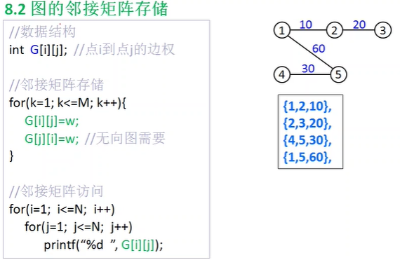

## 8.3图的邻接表存储

通常不用链表实现，用数组模拟

一个图有N个顶点，M条边。

编号计数器num：出边的编号计数器，1<=num<=M

表头数组head[i]:存储顶点i的当前出边的编号num，1<=i<=N

终点数组to[num]:存储num号边的终点，即顶点i的邻接点

边权数组W[num]:存储num号边的权值

指针数组next[num]:存储num号边的下一条边
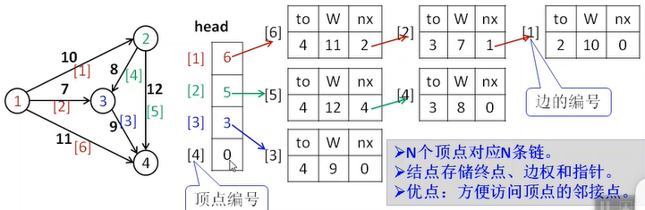


```
//数据结构
int num=0;
int head[maxn];
int to[maxm];
int W[maxm];
int next[maxm];

//添加一条从v1到v2权值为w有向边
void AddEdge(int v1,int v2,int w)
{
    ++num;
    next[num]=head[v1];
    to[num]=v2;
    W[num]=w;
    head[v1]=num;//保存当前边编号
}
//邻接表访问
for(i=1;i<=N;i++)
    for(j=head[i];j;j=next[j])
        printf("%d %d %d",i,to[j],W[j])
```
## 8.4图的邻接点存储
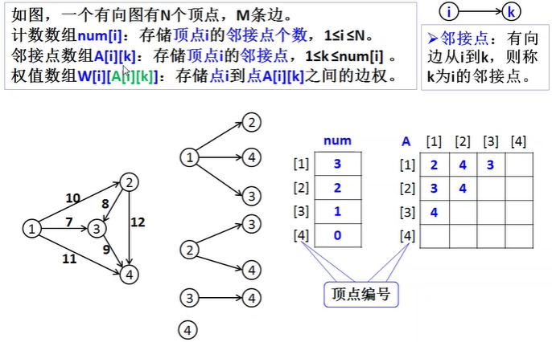

## 8.5 图的边集数组存储
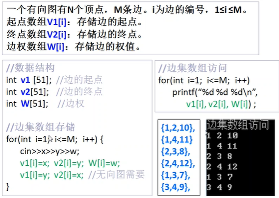
## 8.6 欧拉路径
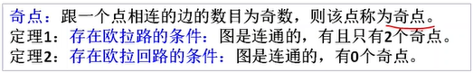
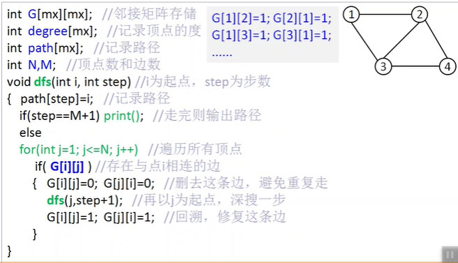
## 8.7哈密顿图
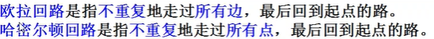
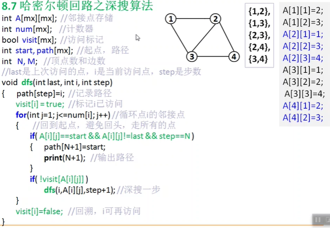

```
#include<iostream>
using namespace std;
#define mx 101
int A[mx][mx]; //邻接点存储
int num[mx];//计数器
bool visit[mx];//访问标记
int path[mx];//记录路径
int start;//路径起点
int N,M;//顶点数和边数
void print(int);//输出路径

void dfs(int last,int i,int step){
	//深搜访问点i,last是上次访问的点，step是步数
    path[step]=i;//记录路径
    visit[i]=true;//标记已访问i
    for(int j=1;j<=num[i];j++)//点i的邻接点
    {
        if(A[i][j]==start&&A[i][j]!=last&&step=N){
			path[N+1]=A[i][j];//回到起点，避免回头，走所有的点
            print(N+1);
        }
        if(!visit[A[i][j]]) dfs(i,A[i][j],step+1);
    }
    visit[i]=false;//回溯，i可再次访问
}
void print(int step){
    for(int i=1;i<step;i++)
        printf("%d--",path[i]);
    printf("%d\n",path[step]);
}
int main(){
	int i,x,y;
    N=4,M=5;
    int a[9][9]={{1,2},{1,3},{2,3},{2,4},{3,4}};
    for(i=1;i<=M;i++){
		x=a[i-1][0];
        y=a[i-1][1];
        A[x][++num[x]]=y;
        A[y][++num[y]]=x;//邻接点存储
    }
    //每个点都作为起点尝试访问，形成森林
    for(start=1;start<=N;start++)
        dfs(start,start,1);
}
```
## 8.8欧拉路之广搜算法

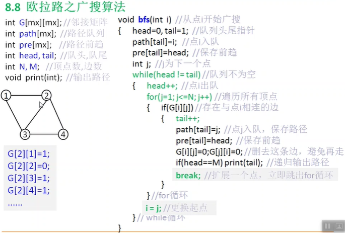

## 8.9无权最短路之广搜算法
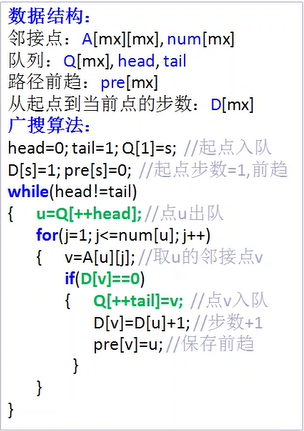

## 8.10有权最短路

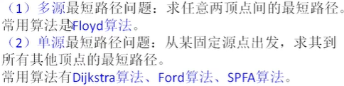

### FLOYD


```
void Floyd(){
     int i,j,k;
     for(k=1;k<=n;k++)
         for(i=1;i<=n;i++)
             for(j=1;j<=n;j++)
                 if(dist[i][k]+dist[k][j]<dist[i][j])
                     dist[i][j]=dist[i][k]+dist[k][j];
 }
```
*Floyd算法*把k(中间点)放在最外层是因为DP

上面这个形式的算法其实是Floyd算法的精简版，而真正的Floyd算法是一种基于DP(Dynamic Programming)的最短路径算法。
 设图G中n 个顶点的编号为1到n。令c [i, j, k]表示从i 到j 的最短路径的长度，其中k 表示该路径中的最大顶点，也就是说c[i,j,k]这条最短路径所通过的中间顶点最大不超过k。因此，如果G中包含边<i, j>，则c[i, j, 0] =边<i, j> 的长度；若i= j ，则c[i,j,0]=0；如果G中不包含边<i, j>，则c (i, j, 0)= +∞。c[i, j, n] 则是从i 到j 的最短路径的长度。
 对于任意的k>0，通过分析可以得到：中间顶点不超过k 的i 到j 的最短路径有两种可能：该路径含或不含中间顶点k。若不含，则该路径长度应为c[i, j, k-1]，否则长度为 c[i, k, k-1] +c [k, j, k-1]。c[i, j, k]可取两者中的最小值。
 状态转移方程：c[i, j, k]=min{c[i, j, k-1], c [i, k, k-1]+c [k, j, k-1]}，k＞0。
 这样，问题便具有了最优子结构性质，可以用动态规划方法来求解。


```
 void floyd_dp(){
     int i,j,k;
     for(i=1;i<=n;i++)
         for(j=1;j<=n;j++)
             dist[i][j][0]=map[i][j];
     for(k=1;k<=n;k++)
         for(i=1;i<=n;i++)
             for(j=1;j<=n;j++){
                 dist[i][j][k]=dist[i][j][k-1];
                 if(dist[i][k][k-1]+dist[k][j][k-1]<dist[i][j][k])
                     dist[i][j][k]=dist[i][k][k-1]+dist[k][j][k-1];
             }
 }
```
### DIJKSTRA
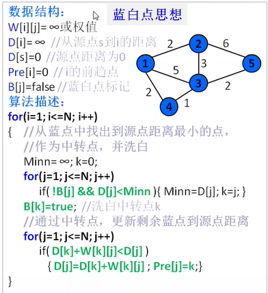

### FORD
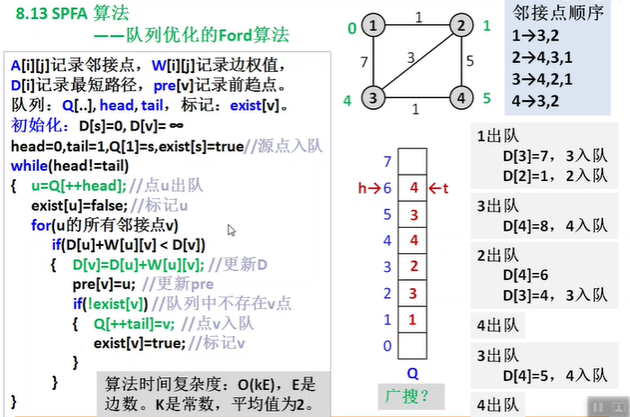

## 8.14最小环

在一张图中找出一个环使得各边权值之和最小
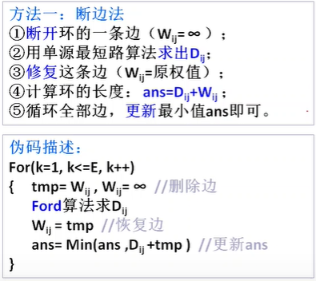

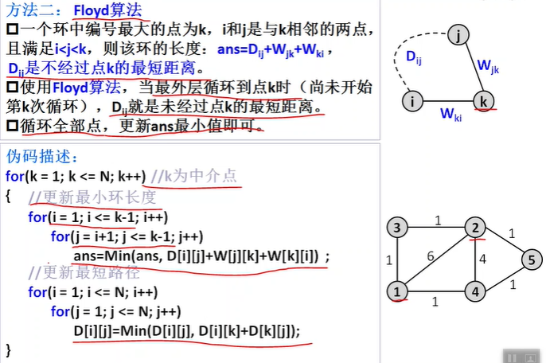

## 8.15并查集
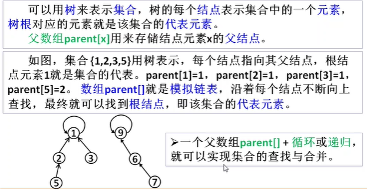
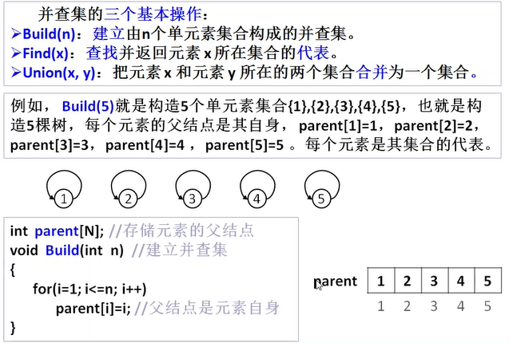
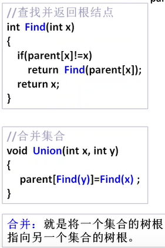
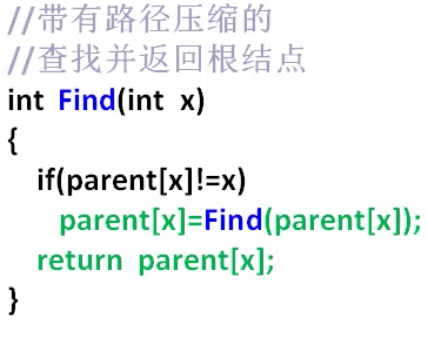
路径压缩的本质就是在每次查找时，把查找路径上的每个结点都直接指向根结点
## 8.18按秩合并

秩就是**树的高度**，按秩合并就是总是将小的数跟指向高度大的树根

```
void Union(int x,int y){
    //按秩合并
    x=Find(x);
    y=Find(y);
    if(Rank[x]<Rank[y])
        parent[x]=y;
    else{
        parent[y]=x;
        if(Rank[y]==Rank[x]&&x!=y)
            Rank[x]++;
    }
}
```
通常使用路径压缩就够了
## 8.19最小生成树
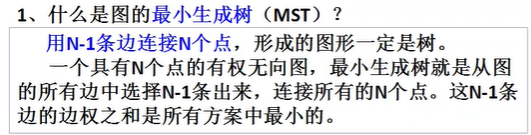

### Kruskal
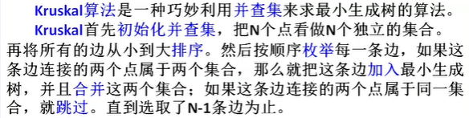

```
#include<iostream>
#include<algorithm>
using namespace std;
struct Edge{
	int u,v,w;
}E[101];
int Parent[101];

int Find()
void Union()
int Cmp(const Edge &a,const Edge &b){
    return (a.w<b.w)?1:0;
}

sort(E+1,E+M+1,Cmp); //M边数
//下略
```

### Prim
贪心算法思想
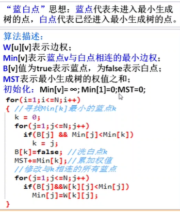

### 8.21AOV网和拓扑排序

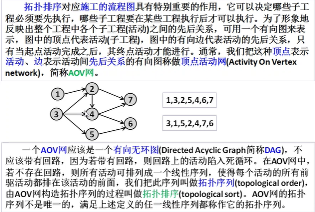

### Kahn算法
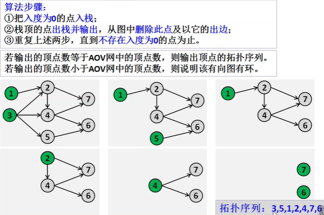
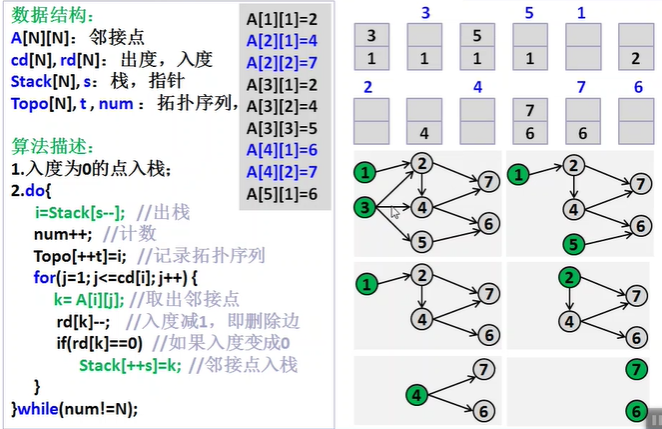
O（V+E)

kahn算法是广搜算法的一种变形

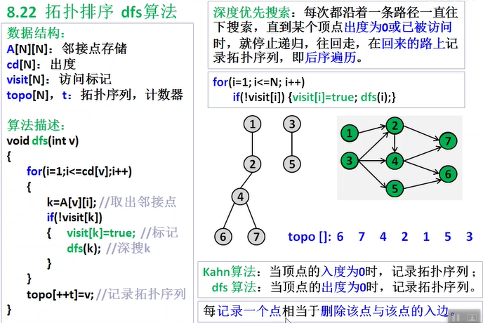
O(V+E),最后采取逆序输出

## 8.23AOE网与关键路径


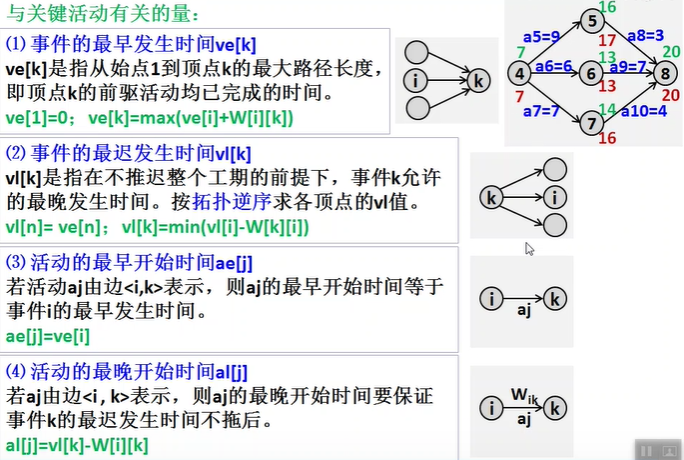
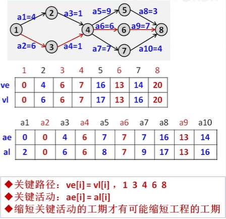

## 8.24广搜 图的遍历

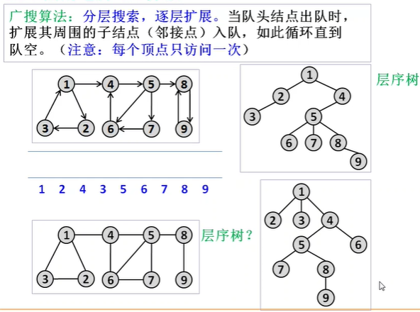
## 8.25深搜 图的遍历
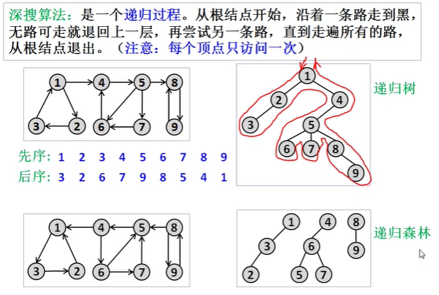

## 8.26强连通分量 kosaraju 算法
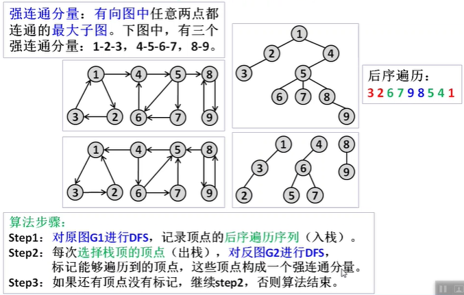
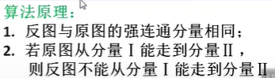


```
#include<iostream>
using namespace std;
//全局区都初始化为0
int A1[99][99],A2[99][99];//邻接点
int vis1[99],vis2[99];//访问
int Stack[99],s;//栈
int set[99],num;//分量以及计数器
void dfs1(int u){//深搜原图
    int i,v;
    for(i=1;i<=A1[u][0];i++){//A1[点][0]记录邻接点数目
		v=A1[u][i];//取出u的邻接点
        if(!vis1[v]){
            vis1[v]=1;
            dfs1(v);
        }
    }
    //后序入栈
    Stack[++s]=u;
    printf("%d ",u);
}

void dfs2(int u,int num){//深搜反图
    int i,v;
    set[u]=num;//下标存储分量的顶点
    for(i=1;i<=A2[u][0];i++){//A2[点][0]记录邻接点数目
		v=A2[u][i];//取出u的邻接点
        if(!vis2[v]){
            vis2[v]=1;
            dfs2(v,num);
        }
    }
}
int main(){
    int i,j,n=9,m=12,a,b;
    int E[15][3]={{},{}...}
    for(i=0;i<m;i++){
		a=E[i][0];
        b=E[i][1];
        A1[a][++A1[a][0]]=b;//存储原图
        A2[b][++A2[b][0]]=a;//存储反图
    }
	//入栈
    for(i=1;i<=n;i++){
        if(!vis1[i]){
            vis1[i]=1;
            dfs1(i);//深搜原图
        }
    }
    while(s){
        a=Stack[s--];//出栈
        if(!vis2[a]){
            vis2[a]=1;
            dfs(a,++num);//深搜反图
        }
    }
    for(i=1;i<=num;i++){//输出分量
        printf("强连通分量%d",i);
    	for(j=1;j<=n;j++)
        if(set[j]==i) printf("%d",j);
    }
}
```

## 8.27??? 强连通分量Tarjan算法
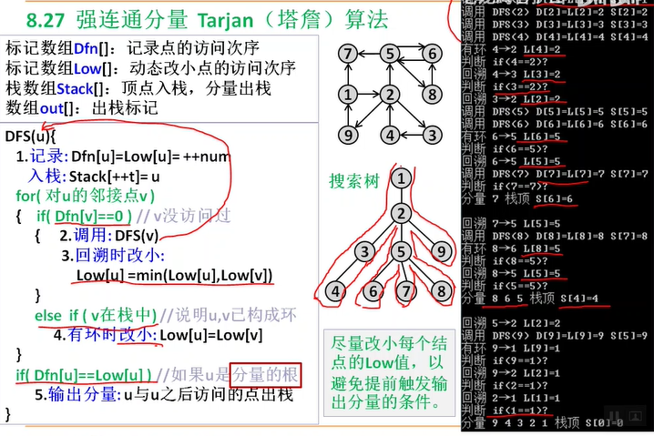

## 8.28？？？强连通分量Gabow算法

