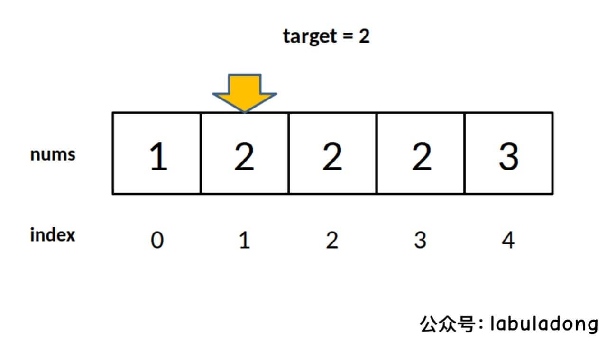
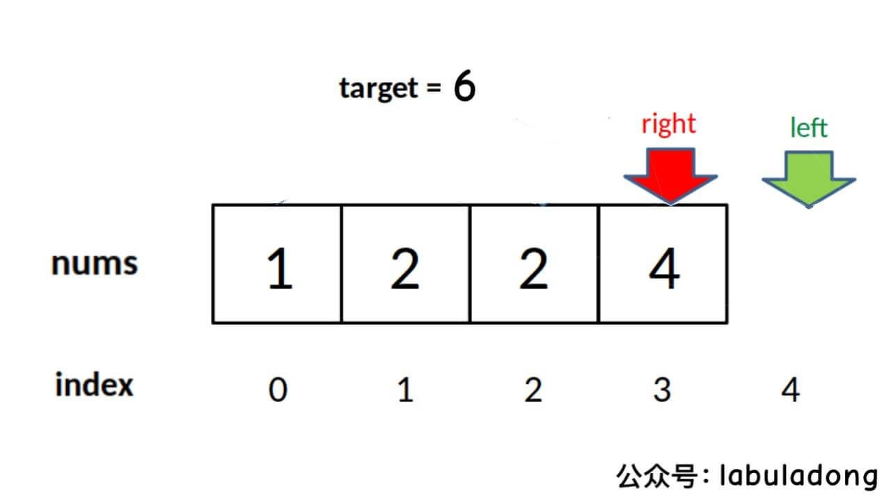

# 一、寻找左侧边界的⼆分搜索
```c++
int left_bound(vector<int> nums, int target) {
    if (nums.length == 0) return -1;
    int left = 0;
    int right = nums.length; // 注意
    while (left < right) { // 注意
        int mid = (left + right) / 2;
        if (nums[mid] == target) {
            right = mid;
        } else if (nums[mid] < target) {
            left = mid + 1;
        } else if (nums[mid] > target) {
            right = mid; // 注意
        }
    }
    return left;
}
```

其中的标记是需要注意的细节：


###  1、为什么 while 中是 < ⽽不是 <= ?
答：⽤相同的⽅法分析，因为 right = nums.length ⽽不是 nums.length -
1 。因此每次循环的「搜索区间」是 [left, right) 左闭右开。

`while(left < right)` 终⽌的条件是 `left == right` ，此时搜索区间 [left,
left) 为空，所以可以正确终⽌。


PS：这⾥先要说⼀个搜索左右边界和上⾯这个算法的⼀个区别，也是很多
读者问的：**刚才的 right 不是 nums.length - 1 吗，为啥这⾥⾮要写成
nums.length 使得「搜索区间」变成左闭右开呢？**

因为对于搜索左右侧边界的⼆分查找，这种写法⽐较普遍，我就拿这种写法
举例了，保证你以后遇到这类代码可以理解。你⾮要⽤两端都闭的写法反⽽
更简单，我会在后⾯写相关的代码，==把三种⼆分搜索都⽤⼀种两端都闭的写
法统⼀起来==，你耐⼼往后看就⾏了。

### 2、为什么没有返回 -1 的操作？如果 nums 中不存在 target 这个值，怎么办？

答：因为要⼀步⼀步来，先理解⼀下这个「左侧边界」有什么特殊含义：


对于这个数组，算法会返回 1。这个 1 的含义可以这样解读： nums 中⼩于
2 的元素有 1 个。

⽐如对于有序数组`nums = [2,3,5,7] , target = 1` ，算法会返回 0，含义
是： nums 中⼩于 1 的元素有 0 个。

再⽐如说 `nums = [2,3,5,7], target = 8` ，算法会返回 4，含义是： nums
中⼩于 8 的元素有 4 个。

综上可以看出，函数的返回值（即 left 变量的值）取值区间是闭区间
`[0, nums.length]` ，所以我们简单添加两⾏代码就能在正确的时候 return
-1：

```cpp
while (left < right) {
    //...
}
// target ⽐所有数都⼤
if (left == nums.length) return -1;
// 类似之前算法的处理⽅式
return nums[left] == target ? left : -1;

```
### 3、为什么 left = mid + 1 ， right = mid ？和之前的算法不⼀样？

答：这个很好解释，因为我们的「搜索区间」是` [left, right) `左闭右
开，所以当 `nums[mid]` 被检测之后，下⼀步的搜索区间应该去掉 mid 分
割成两个区间，即` [left, mid)` 或 `[mid + 1, right)` 。
### 4、为什么该算法能够搜索左侧边界？
答：关键在于对于 nums[mid] == target 这种情况的处理：

```c++
if (nums[mid] == target)c
    right = mid;

```
可⻅，找到 target 时不要⽴即返回，⽽是缩⼩「搜索区间」的上界
right ，在区间 `[left, mid)` 中继续搜索，即不断向左收缩，达到锁定左
侧边界的⽬的。
### 5、为什么返回 left ⽽不是 right ？
答：都是⼀样的，因为 while 终⽌的条件是 left == right 。
### 6、能不能想办法把 right 变成 nums.length - 1 ，也就是继续使⽤两边都闭的「搜索区间」？这样就可以和第⼀种⼆分搜索在某种程度上统⼀起来了。

答：当然可以，只要你明⽩了「搜索区间」这个概念，就能有效避免漏掉元
素，随便你怎么改都⾏。下⾯我们严格根据逻辑来修改：

因为你⾮要让搜索区间两端都闭，所以 right 应该初始化为 nums.length
- 1 ，while 的终⽌条件应该是 left == right + 1 ，也就是其中应该⽤
<= ：


```c++
int left_bound(vector<int> nums, int target) {
    // 搜索区间为 [left, right]
    int left = 0, right = nums.length - 1;
    while (left <= right) {
        int mid = left + (right - left) / 2;
        // if else ...
}

```
因为搜索区间是两端都闭的，且现在是搜索左侧边界，所以 left 和
right 的更新逻辑如下：

```c++
if (nums[mid] < target) {
    // 搜索区间变为 [mid+1, right]
    left = mid + 1;
} else if (nums[mid] > target) {
    // 搜索区间变为 [left, mid-1]
    right = mid - 1;
} else if (nums[mid] == target) {
    // 收缩右侧边界
    right = mid - 1;
}
```

由于 while 的退出条件是 left == right + 1 ，所以当 target ⽐ nums 中
所有元素都⼤时，会存在以下情况使得索引越界：

因此，最后返回结果的代码应该检查越界情况：

```c++
if (left >= nums.length || nums[left] != target)
    return -1;
return left;

```
⾄此，整个算法就写完了，完整代码如下：

```c++
int left_bound(vector<int> nums, int target) {
    int left = 0, right = nums.length - 1;
    // 搜索区间为 [left, right]
    while (left <= right) {
        int mid = left + (right - left) / 2;
        if (nums[mid] < target) {
            // 搜索区间变为 [mid+1, right]
            left = mid + 1;
        } else if (nums[mid] > target) {
            // 搜索区间变为 [left, mid-1]
            right = mid - 1;
        } else if (nums[mid] == target) {
            // 收缩右侧边界
            right = mid - 1;
        }
    }
    // 检查出界情况
    if (left >= nums.length || nums[left] != target)
        return -1;
    return left;
}
```
这样就和第⼀种⼆分搜索算法统⼀了，都是两端都闭的「搜索区间」，⽽且
最后返回的也是 left 变量的值。只要把住⼆分搜索的逻辑，两种形式⼤
家看⾃⼰喜欢哪种记哪种吧。


# 二、寻找右侧边界的⼆分搜索

```c++
int right_bound(vector<int> nums, int target) {
    int left = 0, right = nums.length - 1;
    while (left <= right) {
        int mid = left + (right - left) / 2;
        if (nums[mid] < target) {
            left = mid + 1;
        } else if (nums[mid] > target) {
            right = mid - 1;
        } else if (nums[mid] == target) {
            // 这⾥改成收缩左侧边界即可
            left = mid + 1;
        }
    }
    // 这⾥改为检查 right 越界的情况，
    if (right < 0 || nums[right] != target)
        return -1;
    return right;
}
```
