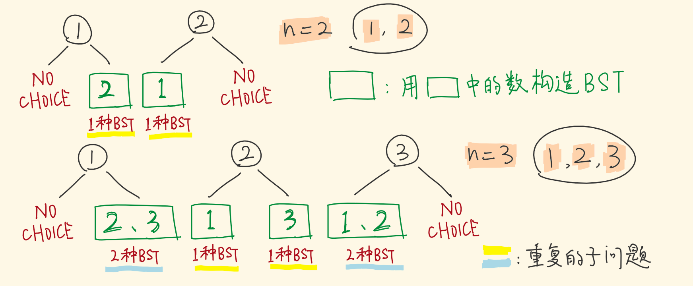
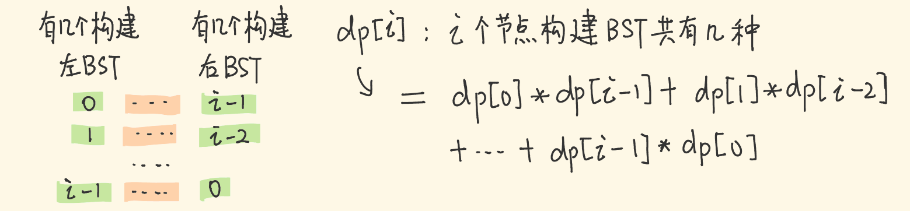

https://leetcode-cn.com/problems/unique-binary-search-trees/

## 定义 DP 子问题

* 用 2、3 构建，和用 1、2 构建，出来的种类数是一样的，因为参与构建的个数一样。
* 再比如 2，3，4 和 1，2，3 都是连着的三个数，构建出的 BSTBST 的种类数相同，属于重复的子问题。
* 定义 dp[i] ：**用连着的 i 个数，所构建出的 BSTBST 种类数**

## 状态转移方程
用 i 个节点构建 BSTBST，除去根节点，剩 i−1 个节点构建左、右子树，左子树分配 0 个，则右子树分配到 i−1 个……以此类推。

左子树用掉 j 个，则右子树用掉 i-j-1 个，能构建出 dp[j] * dp[i-j-1] 种不同的BST。

dp[i]=∑dp[j]∗dp[i−j−1],0<=j<=i−1

base case
当 n=0 时，没有数字，只能形成一种 BSTBST ：空树。
当 n=1 时，只有一个数字，只能形成一种 BSTBST ：单个节点。

