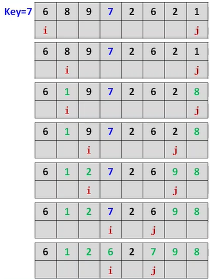
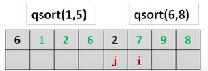
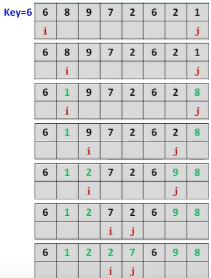
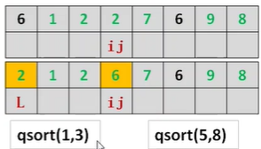
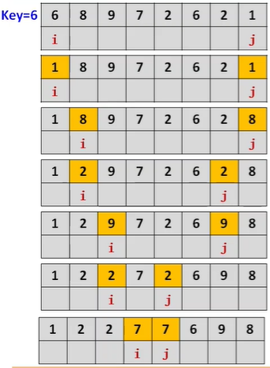
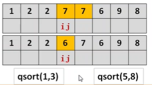
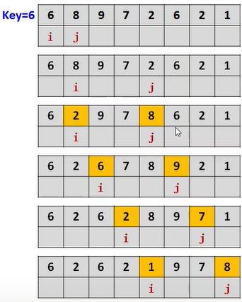
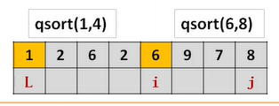

## 快排

1.数组中选一个元素作为关键值

2.数组中小于关键值的数放左边，大的右边，拆分

3.对于左右两段重复过程直至每个子集只有一个元素


### 算法1

```C++
void qsort(int l,int r)
{
    int i=l,j=r;
    int key=a[(l+r)/2];//关键值
    while(i<=j)//去掉等号则边界可能重叠
    {	
        //向右找到第一个大于等于key的数，注意
        while(a[i]<key) i++;
        //向左找到第一个小于等于key的数
        while(a[j]>key) j--;
        
        if(i<=j){//去掉=号可能造成while死循环
            swap(a[i],a[j]);
            i++;j--;//继续找
        }
	}
    if(l<j) qsort(l,j);//递归搜左
    if(i<r) qsort(i,r);//递归搜右
}

```





### 算法2

```c++
void qsort(int L,int R)
{
    int i=L,j=R,key=a[L];//关键值
    while(i<j)
    {
        //向左找到第1个小于key的数
        while(i<j&&a[j]>=key) j--;
        //向右找到第1个大于key的数
        while(i<j&&a[i]<=key) i++;
        if(i!=j) swap(a[i],a[j]);
	}
    swap(a[L],a[i]);//a[L]换到期望的位置
    if(L<i-1) qsort(L,i-1);//递归搜左
    if(i+1<R) qsort(i+1,R);//递归搜右
}
```





### 算法3(轮换)

```C++
void qsort(int L,int R)
{
    int i=L,j=R,key=a[L];
    while(i<j)
    {
        //向左找到第一个小于key的数
        while(i<j&&a[j]>=key) j--;
        a[i]=a[j];//赋值给左边的a[i]
		//向右找到第一个大于key的数
        while(i<j&&a[i]<=key) i++;
        a[j]=a[i];赋值给右边的a[j];
	}
    a[i]=key;//key到期望位置
    if(L<i-1) qsort(L,i-1);
    if(i+1<R) qsort(i+1,R);
}
```





### 算法4

```c++
void qsort(int L,int R)
{
    int i=L,key=a[L];
    for(int j=L+1;j<=R;j++)
        if(a[j]<=key)
        {	//j指向小于等于key的数
            i++;//i指向大于key的数，这一步比较巧妙
            swap(a[i],a[j]);
        }
    swap(a[L],a[i]);//a[L]换到期望的位置
    if(L<i-1) qsort(L,i-1);
    if(i+1<R) qsort(i+1,R);
}
```





