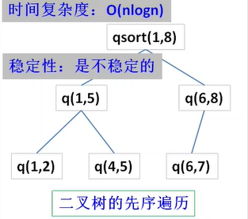

### 解释平均时间复杂度：O(nlogn)

分治算法，每次选出哨兵，根据哨兵元素，用两个指针指向待排序数组的首尾，首指针从前往后移动找到比哨兵元素大的，尾指针从后往前移动找到比哨兵元素小的，交换两个元素，直到两个指针相遇，这是一趟排序，经常这趟排序后，比哨兵元素大的在右边，小的在左边。经过多趟排序后，整个数组有序。一直分下去，直到只有一个元素，平均分开，相当于n个结点的二叉树，共有logn层，递归深度为logn
每一层都需要对当前分组的元素排序，问题规模大概为n，第一层遍历n个元素，第二层遍历n-1个...直到最后一层为一个
nlogn

### 解释空间复杂度O(logn)~O(n)

主要是递归造成的栈空间的使用
最好情况递归树深度为logn，最坏情况为n


### 解释快排的稳定性：不稳定

2、稳定排序

假定在待排序的记录序列中，存在多个具有相同的关键字的记录，若经过排序，这些记录的相对次序保持不变，即在原序列中，r[i]=r[j]，且r[i]在r[j]之前，而在排序后的序列中，r[i]仍在r[j]之前，则称这种排序算法是稳定的；否则称为不稳定的。

快排算法是不稳定的排序算法。例如：

待排序数组:int a[] ={1, 2, 2, 3, 4, 5, 6};

若选择a[2]（即数组中的第二个2）为哨兵，而把大于等于比较子的数均放置在大数数组中，则a[1]（即数组中的第一个2）会到pivot的右边， 那么数组中的两个2非原序。

若选择a[1]为哨兵，而把小于等于比较子的数均放置在小数数组中，则数组中的两个2顺序也非原序。

### 快排的最差情况什么时候发生？
平均情况O(nlogn),最好O(nlogn)，最坏O(n^2)

在快速排序的早期版本中呢，最左面或者是最右面的那个元素被选为枢轴，那最坏的情况就会在下面的情况下发生啦：

1）数组已经是正序排过序的。 （每次最右边的那个元素被选为枢轴）

2）数组已经是倒序排过序的。 （每次最左边的那个元素被选为枢轴）

3）所有的元素都相同（1、2的特殊情况）

因为这些案例在用例中十分常见，所以这个问题可以通过要么选择一个随机的枢轴，或者选择一个分区中间的下标作为枢轴，或者（特别是对于相比更长的分区）选择分区的第一个、中间、最后一个元素的中值作为枢轴。有了这些修改，那快排的最差的情况就不那么容易出现了，但是如果输入的数组最大（或者最小元素）被选为枢轴，那最坏的情况就又来了。

快速排序，在最坏情况退化为冒泡排序，需要比较O(n2)次（n(n - 1)/2次）。

```cpp
class Solution {
public:
    void quickSort(vector<int>& arr, int start, int end) {
        int index = (rand()%(end - start + 1)) + start;
        int key = arr[index];//关键值
        //！！！注意在排序的过程中index位置的值可能改变，因此必须保存key的值
        int i = start,j = end;
        while(i <= j)//去掉等号则边界可能重叠
        {	
            //向右找到第一个大于等于key的数，注意
            while(arr[i] < key) i++;
            //向左找到第一个小于等于key的数
            while(arr[j] > key) j--;

            if(i <= j){//去掉=号可能造成while死循环
                swap(arr[i], arr[j]);//不能使用异或的方法，可能导致自己异或自己为0从而丢失信息
                i++;j--;//继续找
            }
        }
        if(start < j) quickSort(arr, start, j);//递归搜左
        if(i < end) quickSort(arr, i, end);//递归搜右
 
    }
    vector<int> MySort(vector<int>& arr) {
        int n = arr.size();
        quickSort(arr,0,n-1);
        return arr;
    }
};
```

