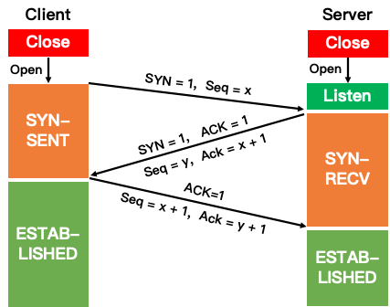
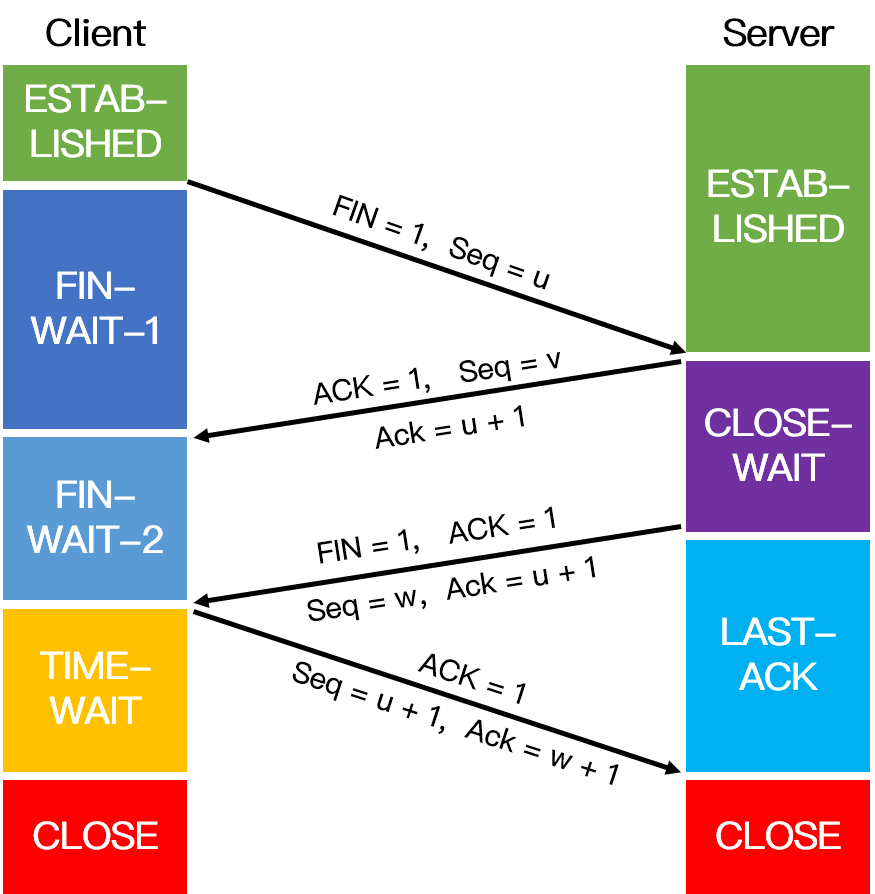

面试高频指数：★★★★★
## 三次握手

!!!注意标志位是大写

三次握手是 TCP 连接的建立过程。在握手之前，主动打开连接的客户端结束 CLOSE 阶段，被动打开的服务器也结束 CLOSE 阶段，并进入 LISTEN 阶段。随后进入三次握手阶段：

1. 第一次握手：首先客户端向服务器发送一个 SYN 包，并等待服务器确认，其中：

* Client将标志位SYN置为1，表示请求建立连接；
* 序号为 Seq = x（x 随机产生,一般为 1）；
* 随后客户端进入 SYN-SENT 阶段，等待Server确认。
2. 第二次握手：服务器接收到客户端发来的 标志位SYN=1的 包后，对该包进行确认后结束 LISTEN 阶段，并返回一段 TCP 报文，其中：

* 标志位为 SYN 和 ACK 都置为1，表示确认客户端的报文 Seq 序号有效，服务器能正常接收客户端发送的数据，并同意创建新连接；
* 序号为 Seq = y(随机产生一个值y)；
* 确认号为 Ack = x + 1，表示收到客户端的序号 Seq 并将其值加 1 作为自己确认号 Ack 的值，随后服务器端进入 SYN-RECV 阶段,此时操作系统为该TCP连接分配TCP缓存和变量。

3. 第三次握手:客户端接收到发送的 SYN + ACK 包后，检查Ack是否为x+1，ACK是否为1,明确了从客户端到服务器的数据传输是正常的，从而结束 SYN-SENT 阶段。并返回最后一段报文,并且此时操作系统为该TCP连接分配TCP缓存和变量。其中：

* 标志位为 ACK=1，表示确认收到服务器端同意连接的信号；
* 序号为 Seq = x + 1，表示收到服务器端的确认号 Ack，并将其值作为自己的序号值；
* 确认号为 Ack= y + 1，表示收到服务器端序号 Seq，并将其值加 1 作为自己的确认号 Ack 的值。
* 随后客户端进入 ESTABLISHED。

当服务器端收到来自客户端确认收到服务器数据的报文后，得知从服务器到客户端的数据传输是正常的，从而结束 SYN-RECV 阶段，进入 ESTABLISHED 阶段，从而完成三次握手。随后Client和Server就可以开始传输数据。

## 四次挥手：

注意中断连接端可以是Client端，也可以是Server端

四次挥手即 TCP 连接的释放，这里假设客户端主动释放连接。在挥手之前主动释放连接的客户端结束 ESTABLISHED 阶段，随后开始四次挥手：

1. 第一次挥手：首先客户端向服务器发送一段 TCP 报文表明其想要释放 TCP 连接，其中：

* 标记位为 FIN = 1，表示请求释放连接；
* 序号为 Seq = u；
* 随后客户端主动关闭TCP连接，进入 FIN-WAIT-1 阶段，即半关闭阶段，并且停止向服务端发送通信数据。
2. 第二次挥手：服务器接收到客户端请求断开连接的 FIN 报文后，结束 ESTABLISHED 阶段，进入 CLOSE-WAIT 阶段并返回一段 TCP 报文，其中：

* 标记位为 ACK=1，表示接收到客户端释放连接的请求；
* 序号为 Seq = v；
* 确认号为 Ack = u + 1，表示是在收到客户端报文的基础上，将其序号值加 1 作为本段报文确认号 Ack 的值；
* 随后服务器进入CLOSE-WAIT（关闭等待）状态，此时的TCP处于半关闭状态，客户端到服务器的连接释放。开始准备释放服务器端到客户端方向上的连接。

客户端收到服务器发送过来的 TCP 报文后，确认服务器已经收到了客户端连接释放的请求，随后客户端结束 FIN-WAIT-1 阶段，进入 FIN-WAIT-2 阶段。

3. 第三次挥手：服务器端在发出 ACK 确认报文后，服务器端会将遗留的待传数据传送给客户端，待传输完成后即经过 CLOSE-WAIT 阶段，便做好了释放服务器端到客户端的连接准备，再次向客户端发出一段 TCP 报文，其中：

* 标记位为 FIN=1 和 ACK=1，表示已经准备好释放连接了；
* 序号为 Seq = w；
* 确认号 Ack = u + 1，表示是在收到客户端报文的基础上，将其序号 Seq 的值加 1 作为本段报文确认号 Ack 的值。

随后服务器端结束 CLOSE-WAIT 阶段，进入 LAST-ACK（最后确认） 阶段。并且停止向客户端发送数据。

4. 第四次挥手：客户端收到从服务器发来的 TCP 报文，确认了服务器已经做好释放连接的准备，于是结束 FIN-WAIT-2 阶段，进入 TIME-WAIT 阶段，并向服务器发送一段报文，其中：

* 标记位为 ACK=1，表示接收到服务器准备好释放连接的信号；
* 序号为 Seq= u + 1，表示是在已收到服务器报文的基础上，将其确认号 Ack 值作为本段序号的值；
* 确认号为 Ack= w + 1，表示是在收到了服务器报文的基础上，将其序号 Seq 的值作为本段报文确认号的值。

此时TCP未释放掉，随后客户端开始在 TIME-WAIT 阶段， 需要等待计时器设置的时间2MSL后，客户端才进入CLOSED状态。服务器端收到从客户端发出的 TCP 报文之后结束 LAST-ACK 阶段，进入 CLOSED 阶段。由此正式确认关闭服务器端到客户端方向上的连接。客户端等待完 2 MSL 之后，结束 TIME-WAIT 阶段，进入 CLOSED 阶段，由此完成「四次挥手」。

注意在TIME\_WAIT状态中，如果TCP client端最后一次发送的ACK丢失了，它将重新发送。TIME_WAIT状态中所需要的时间是依赖于实现方法的。典型的值为30秒、1分钟和2分钟。等待之后连接正式关闭，并且所有的资源(包括端口号)都被释放。

