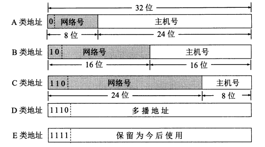

### 网络层

* IP（Internet Protocol，网际协议）是为计算机网络相互连接进行通信而设计的协议。
* ARP（Address Resolution Protocol，地址解析协议）
* ICMP（Internet Control Message Protocol，网际控制报文协议）
* IGMP（Internet Group Management Protocol，网际组管理协议）

#### IP 网际协议

IP 地址分类：

* `IP 地址 ::= {<网络号>,<主机号>}`

| IP 地址类别 | 网络号                                 | 网络范围               | 主机号 | IP 地址范围                  |
| ----------- | -------------------------------------- | ---------------------- | ------ | ---------------------------- |
| A 类        | 8bit，第一位固定为 0                   | 0 —— 127               | 24bit  | 1.0.0.0 —— 127.255.255.255   |
| B 类        | 16bit，前两位固定为  10                | 128.0 —— 191.255       | 16bit  | 128.0.0.0 —— 191.255.255.255 |
| C  类       | 24bit，前三位固定为  110               | 192.0.0 —— 223.255.255 | 8bit   | 192.0.0.0 —— 223.255.255.255 |
| D  类       | 前四位固定为 1110，后面为多播地址      |                        |        |                              |
| E  类       | 前五位固定为 11110，后面保留为今后所用 |                        |        |                              |

IP 数据报格式：

#### ICMP 网际控制报文协议

ICMP 报文格式：

应用：

* PING（Packet InterNet Groper，分组网间探测）测试两个主机之间的连通性
* TTL（Time To Live，生存时间）该字段指定 IP 包被路由器丢弃之前允许通过的最大网段数量

#### 内部网关协议

* RIP（Routing Information Protocol，路由信息协议）
* OSPF（Open Sortest Path First，开放最短路径优先）

#### 外部网关协议

* BGP（Border Gateway Protocol，边界网关协议）

#### IP多播

* IGMP（Internet Group Management Protocol，网际组管理协议）
* 多播路由选择协议

#### VPN 和 NAT

* VPN（Virtual Private Network，虚拟专用网）
* NAT（Network Address Translation，网络地址转换）

#### 路由表包含什么？

1. 网络 ID（Network ID, Network number）：就是目标地址的网络 ID。
2. 子网掩码（subnet mask）：用来判断 IP 所属网络
3. 下一跳地址/接口（Next hop / interface）：就是数据在发送到目标地址的旅途中下一站的地址。其中 interface 指向 next hop（即为下一个 route）。一个自治系统（AS, Autonomous system）中的 route 应该包含区域内所有的子网络，而默认网关（Network id: `0.0.0.0`, Netmask: `0.0.0.0`）指向自治系统的出口。

根据应用和执行的不同，路由表可能含有如下附加信息：

1. 花费（Cost）：就是数据发送过程中通过路径所需要的花费。
2. 路由的服务质量
3. 路由中需要过滤的出/入连接列表