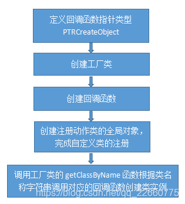

#### C++反射机制的实现

Java中有天然的反射机制，因为Java本身就是半编译语言，很多东西可以在运行时来做，C++原生不支持反射机制，RTTI（运行时类型识别）也仅仅提供了类型的判断。要建立c++的反射机制，就需要登记每个类名与 创建类实例的回调函数 的对应关系。

#### 前言

首先抛出一个问题：如何通过类的名称字符串来生成类的对象。比如有一个类ClassA，那么如何通过类名称字符串”ClassA”来生成类的对象呢？

在Java编程中，会经常要用到反射，但是我想很多使用C++的人至今都没有想过这个问题。C++是不支持通过类名称字符串”ClassXX”来生成对象的，也就是说我们可以使用ClassXX* object =new ClassXX; 来生成对象，但是不能通过ClassXX* object=new “ClassXX”; 来生成对象。

那么我们如何解决这个问题呢？我们可以通过反射来解决这个问题。

但什么是反射呢？我们来个百度百科较官方的定义：反射是程序可以访问、检测和修改它本身状态或行为的一种能力。有点抽象，我的理解**反射就是程序在运行的过程中，可以通过类名称创建对象，并获取类中申明的成员变量和方法**。

#### 具体设计与实现

##### 设计思路

我的设计思路大致是这样的：

- 为需要反射的类中定义一个创建该类对象的一个回调函数；
- 设计一个工厂类，类中有一个std::map，用于保存类名和创建实例的回调函数。通过类工厂来动态创建类对象；-程 序开始运行时，将回调函数存入std::map（哈希表）里面，类名字做为map的key值；

实现流程如下图所示：



##### 具体实现

第一步：定义一个函数指针类型，用于指向创建类实例的回调函数。

```c++
typedef void* (*PTRCreateObject)(void);  
```

第二步：定义和实现一个工厂类，用于保存类名和创建类实例的回调函数。**工厂类的作用仅仅是用来保存类名与创建类实例的回调函数**，所以程序的整个证明周期内无需多个工厂类的实例，所以这里采用**单例模式**来涉及工厂类。

```c++
//ClassFactory.h

#pragma once

#include <string>
#include <map>
typedef void* (*PTRCreateObject)(void);

//工厂类的定义
class ClassFactory {
private:
	std::map<std::string, PTRCreateObject> m_classMap;
	ClassFactory() {}; //构造函数私有化

public:
	void* getClassByName(std::string className);
	void registClass(std::string name, PTRCreateObject method);
	static ClassFactory& getInstance();
};

//工厂类的实现

//@brief:获取工厂类的单个实例对象  
ClassFactory& ClassFactory::getInstance() {
	static ClassFactory sLo_factory;
	return sLo_factory;
}

//@brief:通过类名称字符串获取类的实例
void* ClassFactory::getClassByName(std::string className) {
	auto iter = m_classMap.find(className);
	if (iter == m_classMap.end())
		return NULL;
	else
		return iter->second();
}

//@brief:将给定的类名称字符串和对应的创建类对象的函数保存到map中   
void ClassFactory::registClass(std::string name, PTRCreateObject method) {
	m_classMap.insert(make_pair(name, method));
}

```

第三步： 这一步比较重要，也是最值得深究的一步，也是容易犯迷糊的地方，仔细看。将定义的类注册到工厂类中。**也就是说将类名称字符串和创建类实例的回调函数保存到工厂类的map中**。这里我们又需要完成两个工作，第一个是定义一个创建类实例的回调函数，第二个就是将类名称字符串和我们定义的回调函数保存到工厂类的map中。假设我们定义了一个TestClassA。

```c++
//test class A
class TestClassA{
public:
    void m_print(){
        cout<<"hello TestClassA"<<endl;
    };
};
 
//@brief:创建类实例的回调函数
TestClassA* createObjTestClassA(){
        return new TestClassA;
}

```

好了，我们完了第一个工作，定义了一个创建类实例的回调函数。下面我们要思考一下如何将这个回调函数和对应的类名称字符串保存到工厂类的map中。我这里的一个做法是创建一个全局变量，在创建这个全局变量时，调用的构造函数内将回调函数和对应的类名称字符串保存到工厂类的map中。在这里，这个全局变量的类型我们定义为RegisterAction。

```c++
//ClassFactory.h

//注册动作类
class RegisterAction{
public:
    RegisterAction(std::string className,PTRCreateObject ptrCreateFn){
        ClassFactory::getInstance().registClass(className,ptrCreateFn);
    }
};

```

有个这个注册动作类，我们在每个类定义完成之后，我们就创建一个全局的注册动作类的对象，通过注册动作类的构造函数将我们定义的类的名称和回调函数注册到工厂类的map中。可以在程序的任何一个源文件中创建注册动作类的对象，但是在这里，我们放在回调函数后面创建。后面你就知道为什么这么做了。创建一个注册动作类的对象如下：

```c++
RegisterAction g_creatorRegisterTestClassA("TestClassA",
					(PTRCreateObject)createObjTestClassA);   

```

到这里，我们就完成将类名称和创建类实例的回调函数注册到工厂类的map。下面再以另外一个类TestClassB为例，重温一下上面的步骤：

```c++
//test class B
class TestClassB{
public:
    void m_print(){
        cout<<"hello TestClassB"<<endl;
    };
};
 
//@brief:创建类实例的回调函数
TestClassB* createObjTestClassB{
        return new TestClassB;
}
//注册动作类的全局实例
RegisterAction g_creatorRegisterTestClassB("TestClassB",
					(PTRCreateObject)createObjTestClassB);

```

聪明的你，有没有发现，如果我们再定义一个类C、D….，我们重复的在写大量相似度极高的代码。那么我们如何偷懒呢，让代码变得简洁，提高我们的编码效率。有时我们就应该偷懒，不是说这个世界是懒人们创造的么，当然这些懒人们都很聪明。那么我们如何偷懒呢，如果你想到了宏，恭喜，答对了。其实仔细一看，包括回调函数的定义和注册动作的类的变量的定义，每个类的代码除了类名外其它都是一模一样的，那么我们就可以用下面的宏来替代这些重复代码。

```c++
//Register.h

#define REGISTER(className)                                             \
    className* objectCreator##className(){                              \
        return new className;                                           \
    }                                                                   \
    RegisterAction g_creatorRegister##className(                        \
        #className,(PTRCreateObject)objectCreator##className)

```

有了上面的宏，我们就可以在每个类后面简单的写一个REGISTER(ClassName) 就完成了注册的功能，是不是很方便快捷呢！！

#### 测试

至此，我们就完成了C++反射的部分功能，为什么是部分功能，后面再另外说明。急不可耐，我们先来测试一下，是否解决了上面我们提到的问题：如何通过类的名称字符串来生成类的对象。测试代码如下：

```c++
#include <iostream>

#include "ClassFactory.h"
#include "register.h"

//test class
class TestClass {
public:
	void m_print() {
		std::cout << "hello TestClass" << std::endl;
	};
};
REGISTER(TestClass);

int main(int argc, char* argv[]) {
	TestClass* ptrObj = (TestClass*)ClassFactory::getInstance().getClassByName("TestClass");
	ptrObj->m_print();
}

```

### 还有其它的注册方法吗？

上面具体讲解了通过实现C++的反射来达到通过类名称字符串创建类的实例。其中，在对需要反射的类进行注册的时候，我们用到了一个注册动作类的全局变量，来辅助我们达到注册的功能。除了这个方法，还有没有别的方法呢？大家可以想一想。如有想法，也请留言告之。

仔细一想，我们通过全局对象的构造函数将类的创建实例的函数注册到工厂类中，其实我们是利用了全局对象的初始化执行的构造函数是在程序进入main函数之前执行的，这个问题就可以抽象为C/C++中如何在main()函数之前执行一条语句？

主要有以下几种方法：
（1）全局变量的构造函数。
也就是上面介绍的通过全局对象的构造函数来实现在main函数之前执行想要的操作。但是很明显的副作用就是定义了一个不从使用的全局变量，从出生，完成使命，就被我们无情的抛弃。

（2）使用GCC的话，可以通过attribute关键字声明constructor和destructor分别规定函数在main函数之前执行和之后执行。

（3）指定入口点，入口点中调用原来的入口点
在使用gcc编译C程序时，我们可以使用linker指定入口，使用编译选项-e指明程序入口函数。

（4）可以用main调用main实现在main前执行一段代码，如下：(奇淫技巧)

```c++
#include<stdio.h>
#include<stdbool.h>
 
int main(int argc, char **argv) {
    static _Bool firstTime = true;
    if(firstTime) {
        firstTime = false;
        printf("BEFORE MAIN\n");
        return main(argc, argv);
    }
 
    printf("main\n");
 
    return 0;
}

```

#### 小结

这里先解释一下上文中提出的一个问题，我们为什么只是完成了C++反射的部分功能，因为我们在上面并没有完整的实现C++的反射机制，只能实现了反射机制中的一个小功能模块而已，即通过类名称字符串创建类的实例。除此之外，据我所知，编程语言的反射机制所能实现的功能还有通过类名称字符串获取类中属性和方法，修改属性和方法的访问权限等。

我们为什么需要反射机制。由于在 Java [和.NET](http://xn--0tr.net/) 的成功应用，反射技术以其明确分离描述系统自身结构、行为的信息与系统所处理的信息，建立可动态操纵的因果关联以动态调整系统行为的良好特征，已经从理论和技术研究走向实用化，使得动态获取和调整系统行为具备了坚实的基础。当需要编写扩展性较强的代码、处理在程序设计时并不确定的对象时，反射机制会展示其威力，这样的场合主要有：
(1)序列化（Serialization）和数据绑定（Data Binding）。
(2)远程方法调用（Remote Method Invocation RMI）。
(3)对象/关系数据映射（E/R Mapping）。

当前许多流行的框架和工具，例如 Castor(基于 Java 的数据绑定工具)、Hibernate(基于 Java 的对象/关系映射框架)等，其核心都是使用了反射机制来动态获得类型信息。因此，能够动态获取并操纵类型信息，已经成为现代软件的标志之一。

反射机制如此复杂，C++尚不支持，岂是我这种三教九流之人的只言片语和几个代码片段所能够勾勒描绘的。