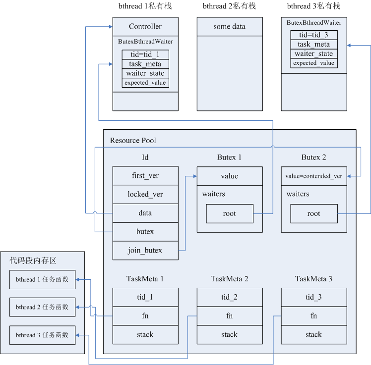

[一次RPC过程中需要bthread互斥的场景](#一次RPC过程中需要bthread互斥的场景)

[bthread互斥过程涉及到的数据结构](#bthread互斥过程涉及到的数据结构)

[brpc实现bthread互斥的源码解释](#brpc实现bthread互斥的源码解释)

## 一次RPC过程中需要bthread互斥的场景
在一次RPC过程中，由于设置RPC超时定时器和开启Backup Request机制，不同的bthread可能会同时操作本次RPC独有的Controller结构，会存在下列几种竞态情况：

1. 第一次Request发出后，在backup_request_ms内未收到响应，触发Backup Request定时器，试图发送Backup Request的同时可能收到了第一次Request的Response，发送Backup Request的bthread和处理Response的bthread需要做互斥；

2. 假设没有开启Backup Request机制，处理Response（可能是第一次Request的Response，也可能是某一次重试的Response）时刚好到了RPC超时时间，处理Response的bthread和处理RPC超时定时任务的bthread需要做互斥；

3. 第一次Request或者任何一次重试Request，与Backup Request可能同时刻收到Response，分别处理两个Response的bthread间需要做互斥；

4. 第一次Request或者任何一次重试Request，与Backup Request可能同时刻收到Response，此时也可能到了RPC超时时间，分别处理两个Response的bthread和处理RPC超时定时任务的bthread，三者之间需要做互斥。

## bthread互斥过程涉及到的数据结构
一次RPC过程中，会有一个Controller对象贯穿本次RPC的始终，Controller对象内存储本次RPC的各类数据和各种状态，bthread间的互斥就是指同一时刻只能有一个bthread在访问Controller对象。互斥主要是通过Id对象和Butex对象实现的。

1. Id对象

   brpc会在每一次RPC过程开始阶段创建本次RPC唯一的一个Id对象，用来保护Controller对象，互斥试图 同时访问Controller对象的多个bthread。Id对象主要成员有：

   - first_ver & locked_ver
   
     如果Id对象的butex锁变量的值（butex指针指向的Butex对象的value值）为first_ver，表示Controller对象此时没有bthread在访问。此时如果有一个bthread试图访问Controller对象，则它可以取得访问权，先将butex锁变量的值置为locked_ver后，再去访问Controller对象。
     
     在locked_ver的基础上又有contended_ver、unlockable_ver、end_ver，contended_ver = locked_ver + 1，unlockable_ver = locked_ver + 2，end_ver = locked_ver + 3。
     
     contended_ver表示同时访问Controller对象的多个bthread产生了竞态。如果有一个bthread（bthread 1）在访问Controller对象结束后，观察到butex锁变量的值仍为locked_ver，表示没有其他的bthread在等待访问Controller对象，bthread 1在将butex锁变量的值改为first_ver后不会再有其他动作。如果在bthread 1访问Controller对象期间又有bthread 2试图访问Controller对象，bthread 2会观察到butex锁变量的值为locked_ver，bthread 2首先将butex锁变量的值改为contended_ver，意图就是告诉bthread 1产生了竞态。接着bthread 2需要将自身的bthread id等信息存储在butex锁变量的waiters等待队列中，yield让出cpu，让bthread 2所在的pthread去执行TaskGroup任务队列中的下一个bthread任务。当bthread 1完成对Controller对象的访问时，会观察到butex锁变量的值已被改为contended_ver，bthread 1会到waiters队列中找到被挂起的bthread 2的id，通知TaskControl将bthread 2的id压入某一个TaskGroup的任务队列，这就是唤醒了bthread 2。bthread 1唤醒bthread 2后会将butex锁变量的值再次改回first_ver。bthread 2重新被某一个pthread调度执行时，如果这期间没有其他bthread在访问Controller对象，bthread 2会观察到butex锁变量的值为first_ver，这时bthread 2获得了Controller对象的访问权。
     
     unlockable_ver表示RPC即将完成，不允许再有bthread去访问Controller对象了。
     
     end_ver表示一次RPC结束后，Id对象被回收到对象池中后*butex 和 *join_butex的值（butex和join_butex都指向Butex对象的第一个元素value，value是个整型值，所以butex和join_butex可转化为指向整型的指针）。end_ver也是被回收的Id对象再次被分配给某一次RPC过程时的first_ver值。
     
     locked_ver的取值和一次RPC的重试次数有关，locked_ver = first_ver + 重试次数 + 2，例如，如果一次RPC过程开始时分配给本次RPC的Id对象的first_ver=1，本次RPC最多允许重试3次，则locked_ver=6，本次RPC的唯一id _correlation_id=1，第一次请求的call_id=2，第一次重试的call_id=3，第二次重试的call_id=4，第三次重试的call_id=5，contended_ver=7，unlockable_ver=8，end_ver=9（_correlation_id和call_id的值只是举例，实际上_correlation_id和call_id都是64bit整型值，前32bit为Id对象在对象池中的slot位移，后32bit为上述的1、2、3...等版本号。服务器返回的Response会回传call_id，通过call_id的前32bit可以在O(1)时间内定位到本次RPC对应的Id对象，方便进行后续的bthread互斥等操作）。

   - mutex
   
     类似futex的线程锁，由于试图同时访问同一Controller对象的若干bthread可能在不同的系统线程pthread上被执行，所以bthread在修改Id对象中的字段前需要先做pthread间的互斥。

   - data
   
     指向本次RPC唯一的一个Controller对象的指针。

   - butex
   
     指向一个Butex对象头节点的指针，该Butex对象用来互斥同时访问Controller对象的多个bthread，waiter队列存储被挂起的等待Controller对象访问权的bthread的tid等信息。
     
   - join_butex
   
     指向另一个Butex对象头节点的指针，如果RPC过程是同步方式，该Butex对象用来同步发起RPC过程的bthread和成功将服务器的Response存入Controller对象的bthread：发起RPC过程的bthread（bthread 1）会执行第一次发送请求的动作，然后会将自己的bthread id等信息存储在join_butex锁的waiters队列中，yield让出cpu，等待某一个能够成功将服务器的Response存入Controller对象的bthread将其唤醒。不论是处理第一次请求的Response的bthread，还是处理某一次重试请求的Response的bthread，只要有一个bthread将Response成功存入Controller对象，就从join_butex锁的waiters队列中拿到bthread 1的bthread id，通知TaskControl将bthread 1的id压入某一个TaskGroup的任务队列，这就是唤醒了bthread 1，bthread 1被某一个pthread重新执行后会从Controller对象中得到Response，进行后续的Response处理工作。
   
2. Butex对象

   Butex对象主要成员是ButexWaiterList类型的waiters，waiters是个等待队列（waiters实际上是一个侵入式链表，增删操作都会在O(1)时间内完成），等待Controller访问权的bthread会在私有栈上创建一个ButexBthreadWaiter对象，并加入到waiters中，ButexBthreadWaiter对象中包含挂起的bthread的tid等信息，释放Controller访问权的bthread可以从waiters队列中拿到挂起的bthread的tid，并负责将挂起的bthread的tid加入某个TaskGroup的任务队列，让它重新得到某个pthread的调度。

假设现在有bthread 1使用同步方式发起了一次RPC请求，发送请求后bthread 1被挂起，等待有bthread向Controller对象填充请求的Response，或者超时。一段时间后处理服务器Response的bthread 2和处理超时的bthread 3同时执行，bthread 2抢到Controller的访问权，bthread 3被挂起。此时Controller、Id、Butex几种对象间的内存关系如下图所示，注意Controller对象分配在bthread 1的私有栈上，两个ButexBthreadWaiter对象也分配在相应bthread的私有栈上，Id对象和Butex对象都是通过ResourcePool机制分配的，被分配在heap堆上，Butex 2的value值是contended_ver，因为bthread 2访问Controller期间有bthread 3在排队等待，bthread 2释放Controller访问权后必须负责唤醒bthread 3，并且bthread 2成功向Controller写入了服务器的Response，满足bthread 1的唤醒条件，bthread 2还必须负责唤醒bthread 1。



## brpc实现bthread互斥的源码解释
brpc实现bthread互斥的主要结构为Id和Butex，关于Butex的细节请见[这篇文章](butex.md)，Id相关的代码在src/bthread/id.cpp中，主要的一些函数如下：

- bthread_id_lock_and_reset_range_verbose：访问共享数据前，竞争butex锁、等待butex锁：

```c++
// bthread访问Controller对象前必须要执行bthread_id_lock，实际上是调用bthread_id_lock_and_reset_range_verbose。
// 在这个函数中bthread会根据锁变量（Id的butex指针指向的Butex结构中value）的当前值，来判断下一步的动作：
// 1、如果锁变量当前值=first_ver，说明当前没有bthread在访问Controller，则把锁变量的值置为locked_ver，
//    告诉后来的bthread“我正在访问Controller，其他bthread先等待”，再去访问Controller；
// 2、如果锁变量当前值=locked_ver或contended_ver，则当前bthread需要挂起，正在访问Controller的bthread结束访问后
//    会负责唤醒挂起的bthread。
// 参数中，id是请求的call_id（要和RPC的correlation_id区分开），*pdata是共享对象（如Controller）的地址，
// range=RPC重试次数+2。
int bthread_id_lock_and_reset_range_verbose(
    bthread_id_t id, void **pdata, int range, const char *location) {
    // 通过id的前32bits，在O(1)时间内定位到Id对象的地址。
    bthread::Id* const meta = address_resource(bthread::get_slot(id));
    if (!meta) {
        return EINVAL;
    }
    // id_ver是call_id（一次RPC由于重试等因素可能产生多次call，每个call有其唯一id）。
    const uint32_t id_ver = bthread::get_version(id);
    // butex指针指向的是Butex结构的第一个元素：整型变量value，这就是锁变量。
    uint32_t* butex = meta->butex;
    // 函数的局部变量都是分配在各个bthread的私有栈上的，所以每个bthread看到的不是同一个ever_contended。
    bool ever_contended = false;
    // 这段代码可以被位于不同pthread上的多个bthread同时执行，所以需要先加线程锁。
    meta->mutex.lock();
    while (meta->has_version(id_ver)) {
        if (*butex == meta->first_ver) {
            // 执行到这里，表示当前没有其他bthread在访问Controller。
            // contended locker always wakes up the butex at unlock.
            meta->lock_location = location;
            if (range == 0) {
                // fast path
            } else if (range < 0 ||
                       range > bthread::ID_MAX_RANGE ||
                       range + meta->first_ver <= meta->locked_ver) {
                LOG_IF(FATAL, range < 0) << "range must be positive, actually "
                                         << range;
                LOG_IF(FATAL, range > bthread::ID_MAX_RANGE)
                    << "max range is " << bthread::ID_MAX_RANGE
                    << ", actually " << range;
            } else {
                // range的值是“一次RPC的重试次数+2”，
                // 如果first_ver=1，一次RPC在超时时间内允许重试3次，则locked_ver=6。
                meta->locked_ver = meta->first_ver + range;
            }
            // 1、如果是第一个访问Controller的bthread走到这里，则把锁变量的值置为locked_ver；
            // 2、如果是曾经因等待锁而被挂起的bthread走到这里，则把锁变量的值置为contended_ver。
            *butex = (ever_contended ? meta->contended_ver() : meta->locked_ver);
            // 锁变量已经被重置，后来的bthread看到锁变量最新值后就会得知已经有一个bthread在访问Controller，
            // 当前bthread可以释放pthread线程锁了。
            meta->mutex.unlock();
            if (pdata) {
                // 找到Controller对象的指针并返回。
                *pdata = meta->data;
            }
            return 0;
        } else if (*butex != meta->unlockable_ver()) {
            // 1、一个bthread（假设bthread id为C）执行到这里，锁变量的当前值（Butex的value值）
            //    要么是locked_ver，要么是contented_ver：
            //    a、如果锁变量的当前值=locked_ver，表示当前有一个bthread A正在访问Controller且还没有访问完成，
            //       且锁的等待队列中没有其他bthread被挂起；
            //    b、如果锁变量的当前值=contented_ver，表示当前不仅有一个bthread A正在访问Controller且还没有
            //       访问完成，而且还有一个或多个bthread（B、D、E...）被挂起，等待唤醒。
            // 2、执行到这段代码的bthread必须要挂起，挂起前先将锁变量的值置为contended_ver，告诉正在访问Controller
            //    的bthread，访问完Controller后，要负责唤醒挂起的bthread；
            // 3、挂起是指：bthread将cpu寄存器的上下文存入context结构，让出cpu，执行这个bthread的pthread从TaskGroup
            //    的任务队列中取出下一个bthread去执行。
                  
            // 将锁变量的值置为contended_ver。  
            *butex = meta->contended_ver();
            // 记住竞争锁失败时的锁变量的当前值，在bthread真正执行挂起动作前，要再次检查锁变量的最新值，只有挂起前的
            // 锁变量最新值与expected_ver相等，bthread才能真正挂起；如果不等，锁可能已被释放，bthread不能挂起，否则
            // 可能永远无法被唤醒，这时bthread应该放弃挂起动作，再次去竞争butex锁。
            uint32_t expected_ver = *butex;
            // 关键字段的重置已完成，可以释放pthread线程锁了。
            meta->mutex.unlock();
            // 已经出现了bthread间的竞态。
            ever_contended = true;
            // 在butex_wait内部，新建ButexWaiter结构保存该bthread的主要信息并将ButexWaiter加入锁的等待队列waiters
            // 链表，然后yield让出cpu。
            // bthread真正挂起前，要再次判断锁变量的最新值是否与expected_ver相等。
            if (bthread::butex_wait(butex, expected_ver, NULL) < 0 &&
                errno != EWOULDBLOCK && errno != EINTR) {
                return errno;
            }
            
            // 这里是bthread被唤醒后，恢复执行点。
            
            // 之前挂起的bthread被重新执行，先要再次去竞争pthread线程锁。不一定能竞争成功，所以上层要有一个while循环
            // 不断的去判断被唤醒的bthread抢到pthread线程锁后可能观察到的butex锁变量的各种不同值。
            meta->mutex.lock();
        } else { // bthread_id_about_to_destroy was called.
            // Butex的value被其他bthread置为unlockable_ver，Id结构将被释放回资源池，Controller结构将被析构，
            // 即一次RPC已经完成，因此执行到这里的bthread直接返回，不会再有后续的动作。
            meta->mutex.unlock();
            return EPERM;
        }
    }
    meta->mutex.unlock();
    return EINVAL;
}
```

- bthread_id_unlock：释放butex锁，从锁的等待队列中唤醒一个bthread：

```c++
int bthread_id_unlock(bthread_id_t id) {
    // 通过id的前32bits，在O(1)时间内定位到Id对象的地址。
    bthread::Id* const meta = address_resource(bthread::get_slot(id));
    if (!meta) {
        return EINVAL;
    }
    uint32_t* butex = meta->butex;
    // Release fence makes sure all changes made before signal visible to
    // woken-up waiters.
    const uint32_t id_ver = bthread::get_version(id);
    // 竞争pthread线程锁。
    meta->mutex.lock();
    if (!meta->has_version(id_ver)) {
        // call_id非法，严重错误。
        meta->mutex.unlock();
        LOG(FATAL) << "Invalid bthread_id=" << id.value;
        return EINVAL;
    }
    if (*butex == meta->first_ver) {
        // 一个bthread执行到这里，观察到的butex锁变量的当前值要么是locked_ver，要么是contented_ver，
        // 不可能是first_ver，否则严重错误。
        meta->mutex.unlock();
        LOG(FATAL) << "bthread_id=" << id.value << " is not locked!";
        return EPERM;
    }
    bthread::PendingError front;
    if (meta->pending_q.pop(&front)) {
        meta->lock_location = front.location;
        meta->mutex.unlock();
        // 
        if (meta->on_error) {
            return meta->on_error(front.id, meta->data, front.error_code);
        } else {
            return meta->on_error2(front.id, meta->data, front.error_code,
                                   front.error_text);
        }
    } else {
        // 如果锁变量的当前值为contended_ver，则有N（N>=1）个bthread挂在锁的waiters队列中，等待唤醒。
        const bool contended = (*butex == meta->contended_ver());
        // 重置锁变量的值为first_ver，表示当前的bthread对Controller的独占性访问已完成，后续被唤醒的bthread可以去
        // 竞争对Controller的访问权了。
        *butex = meta->first_ver;
        // 关键字段已完成更新，释放线程锁。
        meta->mutex.unlock();
        if (contended) {
            // We may wake up already-reused id, but that's OK.
            // 唤醒waiters等待队列中的一个bthread。
            bthread::butex_wake(butex);
        }
        return 0; 
    }
}
```

- bthread_id_join：负责RPC发送过程的bthread完成发送动作后，会调用bthread_id_join将自身挂起，等待处理服务器Response的bthread来唤醒。这时是挂在join_butex锁的等待队列中的，与butex锁无关。

```c++
int bthread_id_join(bthread_id_t id) {
    // 通过id的前32bits，在O(1)时间内定位到Id对象的地址。
    const bthread::IdResourceId slot = bthread::get_slot(id);
    bthread::Id* const meta = address_resource(slot);
    if (!meta) {
        // The id is not created yet, this join is definitely wrong.
        return EINVAL;
    }
    const uint32_t id_ver = bthread::get_version(id);
    uint32_t* join_butex = meta->join_butex;
    while (1) {
        meta->mutex.lock();
        const bool has_ver = meta->has_version(id_ver);
        const uint32_t expected_ver = *join_butex;
        meta->mutex.unlock();
        if (!has_ver) {
            break;
        }
        // 将ButexWaiter挂在join_butex锁的等待队列中，bthread yield让出cpu。
        // bthread恢复执行的时候，一般是RPC过程已经完成时。
        if (bthread::butex_wait(join_butex, expected_ver, NULL) < 0 &&
            errno != EWOULDBLOCK && errno != EINTR) {
            return errno;
        }
    }
    return 0;
}
```
