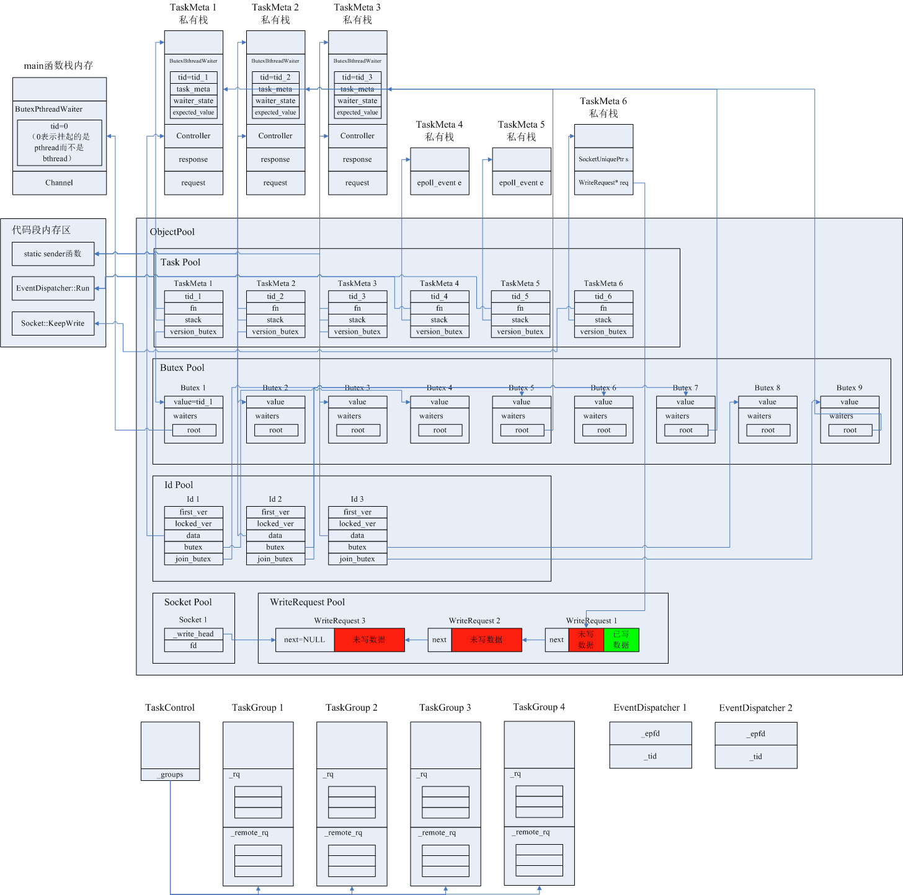

[数据发送过程涉及到的主要数据结构](#数据发送过程涉及到的主要数据结构) 

[数据发送过程中的系统内存布局与多线程执行状态](#数据发送过程中的系统内存布局与多线程执行状态) 

## 数据发送过程涉及到的主要数据结构
1. Channel对象：表示客户端与一台服务器或一组服务器的连接通道。

2. Controller对象：存储一次完整的RPC请求的Context以及各种状态。

3. Butex对象：实现bthread粒度的互斥锁，管理锁的挂起等待队列。

4. Id对象：同步一次RPC过程中的各个bthread（发送数据、处理服务器的响应、处理超时均由不同的bthread完成）。

## 数据发送过程中的系统内存布局与多线程执行状态
以brpc自带的实例程序example/multi_threaded_echo_c++/client.cpp为例，结合Client端内存布局的变化过程和多线程执行过程，阐述无异常状态下（所有发送数据都及时得到响应，没有超时、没有因服务器异常等原因引发的请求重试）的Client发送请求直到处理响应的过程。

该程序运行后，会与单台服务器建立一条TCP长连接，创建thread_num个bthread（后续假设thread_num=3）在此TCP连接上发送、接收数据，不涉及连接池、负载均衡。RPC使用同步方式，这里的同步是指bthread间的同步：负责发送数据的bthread完成发送操作后，不能结束，而是需要挂起，等待负责接收服务器响应的bthread将其唤醒后，再恢复执行。挂起时会让出cpu，pthread可继续执行任务队列中的其他bthread。

具体运行过程为：

1. 在main函数的栈上创建一个Channel对象，并初始化Channel的协议类型、连接类型、RPC超时时间、请求重试次数等参数，上述参数后续会被赋给所有通过此Channel的RPC请求；

2. 在main函数中调用bthread_start_background创建3个bthread，此时TaskControl、TaskGroup对象都并不存在，所以此时需要在heap内存上创建它们（惰性初始化方式，不是在程序启动时就创建所有的对象，而是到对象确实要被用到时才去创建）：

   - 一个TaskControl单例对象；
   
   - N个TaskGroup对象（后续假设N=4），每个TaskGroup对应一个系统线程pthread，是pthread的线程私有对象，每个pthread启动后以自己的TaskGroup对象的run_main_task函数作为主工作函数，在该函数内执行无限循环，不断地从TaskGroup的任务队列中取得bthread id、通过id找到bthread对象、去执行bthread任务函数。
   
3. 在TaskMeta对象池中创建3个TaskMeta对象（每个TaskMeta等同一个bthread），每个TaskMeta的fn函数指针指向client.cpp中定义的static类型函数sender，sender就是bthread的任务处理函数。每个TaskMeta创建完后，按照散列规则找到一个TaskGroup对象，并将tid（也就是bthread的唯一标识id）压入该TaskGroup对象的_remote_rq队列中（TaskGroup所属的pthread线程称为worker线程，worker线程自己产生的bthread的tid会被压入自己私有的TaskGroup对象的_rq队列，本实例中的main函数所在线程不属于worker线程，所以main函数所在的线程生成的bthread的tid会被压入找到的TaskGroup对象的_rq队列）；

4. main函数执行到这里，不能直接结束（否则Channel对象会被马上析构，所有RPC无法进行），必须等待3个bthread全部执行sender函数结束后，main才能结束。

   - main函数所在线程挂起的实现机制是，将main函数所在线程的信息存储在ButexPthreadWaiter中，并加入到TaskMeta对象的version_butex指针所指的Butex对象的等待队列waiters中，TaskMeta的任务函数fn执行结束后，会从waiters中查找到“之前因等待TaskMeta的任务函数fn执行结束而被挂起的”pthread线程，再将其唤醒。关于Butex机制的细节，可参见[这篇文章](butex.md)；
   
   - main函数所在的系统线程在join bthread 1的时候就被挂起，等待在wait_pthread函数处。bthread 1执行sender函数结束后，唤醒main函数的线程，main函数继续向下执行，去join bthread 2。如果此时bthread 2仍在运行，则再将存储了main函数所在线程信息的一个新的ButexPthreadWaiter加入到bthread 2对应的TaskMeta对象的version_butex指针所指的Butex对象的等待队列waiters中，等到bthread 2执行完sender函数后再将main函数所在线程唤醒。也可能当main函数join bthread 2的时候bthread 2已经运行完成，则join操作直接返回，接着再去join bthread 3；
   
   - 只有当三步join操作全部返回后，main函数才结束。  
   
5. 此时Client进程内部的线程状态是：

   - bthread状态：三个bthread 1、2、3已经创建完毕，各自的bthread id已经被分别压入不同的TaskGroup对象（设为TaskGroup 1、2、3）的任务队列_remote_rq中；
   
   - pthread状态：此时进程中存在5个pthread线程：3个pthread即将从各自私有的TaskGroup对象的_remote_rq中拿到bthread id，将要执行bthread id对应的TaskMeta对象的任务函数；1个pthread仍然阻塞在run_main_task函数上，等待新任务到来通知；main函数所在线程被挂起，等待bthread 1执行结束。
   
6. 此时Client进程内部的内存布局如下图所示，由于bthread 1、2、3还未开始运行，未分配任何局部变量，所以此时各自的私有栈都是空的：
   
    

7. TaskGroup 1、2、3分别对应的3个pthread开始执行各自拿到的bthread的任务函数，即client.cpp中的static类型的sender函数。由于各个bthread有各自的私有栈空间，所以sender中的局部变量request、response、Controller对象均被分配在bthread的私有栈内存上；

8. 根据protobuf的标准编程模式，3个执行sender函数的bthread都会执行Channel的CallMethod函数，CallMethod负责的工作为：

   - CallMethod函数的入参为各个bthread私有的request、response、Controller，CallMethod内部会为Controller对象的相关成员变量赋值，包括RPC起始时间戳、最大重试次数、RPC超时时间、Backup Request超时时间、标识一次RPC过程的唯一id correlation_id等等。Controller对象可以认为是存储了一次RPC过程的所有Context上下文信息;
   
   - 在CallMethod函数中不存在线程间的竞态，CallMethod本身是线程安全的。而Channel对象是main函数的栈上对象，main函数所在线程已被挂起，直到3个bthread全部执行完成后才会结束，所以Channel对象的生命期贯穿于整个RPC过程;
   
   - 构造Controller对象相关联的Id对象，Id对象的作用是同步一次RPC过程中的各个bthread，因为在一次RPC过程中，发送请求、接收响应、超时处理均是由不同的bthread负责，各个bthread可能运行在不同的pthread上，因此这一次RPC过程的Controller对象可能被上述不同的bthread同时访问，也就是相当于被不同的pthread并发访问，产生竞态。此时不能直接让某个pthread去等待线程锁，那样会让pthread挂起，阻塞该pthread私有的TaskGroup对象的任务队列中其他bthread的执行。因此如果一个bthread正在访问Controller对象，此时位于不同pthread上的其他bthread若想访问Controller，必须将自己的bthread信息加入到一个等待队列中，yield让出cpu，让pthread继续去执行任务队列中下一个bthread。正在访问Controller的bthread让出访问权后，会从等待队列中找到挂起的bthread，并将其bthread id再次压入某个TaskGroup的任务队列，这样就可让原先为了等待Controller访问权而挂起的bthread得以从yield点恢复执行。这就是bthread级别的挂起-唤醒的基本原理，这样也保证所有pthread是wait-free的。
   
   - 在CallMethod中会通过将Id对象的butex指针指向的Butex结构的value值置为“locked_ver”表示Id对象已被锁，即当前发送数据的bthread正在访问Controller对象。在本文中假设发送数据后正常接收到响应，不涉及重试、RPC超时等，所以不深入阐述Id对象，关于Id的细节请参考[这篇文章](client_bthread_sync.md)。

9. pthread线程执行流程接着进入Controller的IssueRPC函数，在该函数中：

   - 按照指定协议格式将RPC过程的首次请求的call_id、RPC方法名、实际待发送数据打包成报文；
   
   - 调用Socket::Write函数执行实际的发送数据过程。Socket对象表示Client与单台Server的连接。向fd写入数据的细节过程参考[这篇文章](io_write.md)；
   
   - 在实际发送数据前需要先建立与Server的TCP长连接，并惰性初始化event_dispatcher_num个EventDispatcher对象（假设event_dispatcher_num=2），从而新建2个bthread 4和5，并将它们的任务处理函数设为static类型的EventDispatcher::RunThis函数，当bthread 4、5得到pthread执行时，会调用epoll_wait检测是否有I/O事件触发。brpc是没有专门的I/O pthread线程的；
   
   - 从Socket::Write函数返回后，调用bthread_id_unlock释放对Controller对象的独占访问。
   
10. 因为RPC使用synchronous同步方式，所以bthread完成数据发送后调用bthread_id_join将自身挂起，让出cpu，等待负责接收服务器响应的bthread来唤醒。此时Client进程内部的线程状态是：bthread 1、2、3都已挂起，执行bthread任务的pthread 1、2、3分别跳出了bthread 1、2、3的任务函数，回到TaskGroup::run_main_task函数继续等待新的bthread任务，因为在向fd写数据的过程中通常会新建一个KeepWrite bthread（bthread 6），假设这个bthread的id被压入到TaskGroup 4的任务队列中，被pthread 4执行，所以pthread 1、2、3此时没有新bthread可供执行，处于系统线程挂起状态。

11. 此时Client进程内部的内存布局如下图所示，注意各个类型对象分配在不同的内存区，比如Butex对象、Id对象分配在heap上，Controller对象、ButexBthreadWaiter对象分配在bthread的私有栈上：

    

12. KeepWrite bthread完成工作后，3个请求都被发出，假设服务器正常返回了3个响应，由于3个响应是在一个TCP连接上接收的，所以bthread 4、5二者只会有一个通过epoll_wait()检测到fd可读，并新建一个bthread 7去负责将fd的inode输入缓存中的数据读取到应用层，在拆包过程中，解析出一条Response，就为这个Response的处理再新建一个bthread，目的是实现响应读取+处理的最大并发。因此Response 1在bthread 8中被处理，Response 2在bthread 9中被处理，Response 3在bthread 7中被处理（最后一条Response不需要再新建bthread了，直接在bthread 7本地处理即可）。bthread 8、9、7会将Response 1、2、3分别复制到相应Controller对象的response中，这时应用程序就会看到响应数据了。bthread 8、9、7也会将挂起的bthread 1、2、3唤醒，bthread 1、2、3会恢复执行，可以对Controller对象中的response做一些操作，并开始发送下一个RPC请求。
