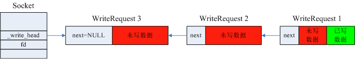
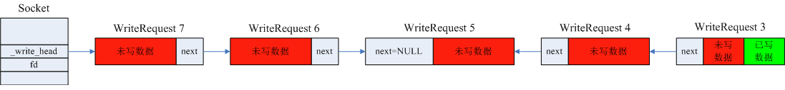

[多线程向同一个TCP连接写数据的设计原理](#多线程向同一个TCP连接写数据的设计原理) 

[brpc中的代码实现](#brpc中的代码实现) 

[一个实际场景下的示例](#一个实际场景下的示例) 

## 多线程向同一个TCP连接写数据的设计原理
考虑brpc自带的示例程序example/multi_threaded_echo_c++/client.cpp，use_bthread为true的情况下，多个bthread通过一条TCP长连接向服务端发送数据，而多个bthread通常又是运行在多个系统线程pthread上的，所以多个pthread如何高效且线程安全地向一个TCP连接写数据，是系统设计需要重点考虑的。brpc针对这个问题的设计思路如下：

1. 为每个可被多线程写入数据的fd维护一个单项链表，每个试图向fd写数据的线程首先判断自己是不是当前第一个向fd写数据的线程，如果是，则持有写数据的权限，可以执行向fd写数据的操作；如果不是，则将待写数据加入链表就即刻返回（bthread执行结束，挂起，等待响应数据）。

2. 掌握写权限的线程，在向fd写数据的时候，不仅可以写本线程持有的待写数据，而且可以观察到fd的链表上是否还加入了其他线程的待写数据，写入的时候可以尽量写入足够多的数据，但只执行一次写操作，如果因为fd的内核inode输出缓冲区已满而未能全部写完，则启动一个新的bthread去执行后续的写操作，当前bthread立即返回（被挂起，等待响应response的bthread唤醒）。

3. 新启动的执行写操作的bthread，负责将fd的链表上的所有待写入数据写入fd（后续可能会有线程不断将待写数据加入待写链表），直到将链表清空。如果fd的内核inode缓冲区已满而不能写入，则该bthread将被挂起，让出cpu。等到epoll通知fd可写时，该thread再被唤起，继续写入。

4. KeepWrite bthread直到通过一个原子操作判断出_write_hread已为NULL时，才会执行完成，如果同时刻有一个线程通过原子操作判断出_write_hread为NULL，则重复上述过程1，所以不可能同时有两个KeepWrite bthread存在。

5. 按照如上规则，所有bthread都不会有任何的等待操作，这就做到了wait-free，当然也是lock-free的（判断自己是不是第一个向fd写数据的线程的操作实际上是个原子交换操作）。

下面结合brpc的源码来阐述这套逻辑的实现。

## brpc中的代码实现
brpc中的Socket类对象代表Client端与Server端的一条TCP连接，其中主要函数有：

- StartWrite函数：每个bthread向TCP连接写数据的入口，在实际环境下通常会被多个pthread执行，必须要做到线程安全：

```c++
int Socket::StartWrite(WriteRequest* req, const WriteOptions& opt) {
    // Release fence makes sure the thread getting request sees *req
    // 与当前_write_head做原子交换，_write_head初始值是NULL，
    // 如果是第一个写fd的线程，则exchange返回NULL，并将_write_head指向第一个线程的待写数据，
    // 如果不是第一个写fd的线程，exchange返回值是非NULL，且将_write_head指向最新到来的待写数据。
    WriteRequest* const prev_head =
        _write_head.exchange(req, butil::memory_order_release);
    if (prev_head != NULL) {
        // Someone is writing to the fd. The KeepWrite thread may spin
        // until req->next to be non-UNCONNECTED. This process is not
        // lock-free, but the duration is so short(1~2 instructions,
        // depending on compiler) that the spin rarely occurs in practice
        // (I've not seen any spin in highly contended tests).
        // 如果不是第一个写fd的bthread，将待写数据加入链表后，就返回。
        req->next = prev_head;
        return 0;
    }

    int saved_errno = 0;
    bthread_t th;
    SocketUniquePtr ptr_for_keep_write;
    ssize_t nw = 0;

    // We've got the right to write.
    // req指向的是第一个待写数据，肯定是以_write_head为头部的链表的尾结点，next一定是NULL。
    req->next = NULL;
    
    // Connect to remote_side() if not.
    // 如果TCP连接未建立，则在ConnectIfNot内部执行非阻塞的connect，并将自身挂起，
    // 等待epoll通知连接已建立后再被唤醒执行。
    int ret = ConnectIfNot(opt.abstime, req);
    if (ret < 0) {
        saved_errno = errno;
        SetFailed(errno, "Fail to connect %s directly: %m", description().c_str());
        goto FAIL_TO_WRITE;
    } else if (ret == 1) {
        // We are doing connection. Callback `KeepWriteIfConnected'
        // will be called with `req' at any moment after
        // TCP连接建立中，bthread返回、挂起，等待唤醒。
        return 0;
    }

    // NOTE: Setup() MUST be called after Connect which may call app_connect,
    // which is assumed to run before any SocketMessage.AppendAndDestroySelf()
    // in some protocols(namely RTMP).
    req->Setup(this);
    
    if (ssl_state() != SSL_OFF) {
        // Writing into SSL may block the current bthread, always write
        // in the background.
        goto KEEPWRITE_IN_BACKGROUND;
    }
    
    // Write once in the calling thread. If the write is not complete,
    // continue it in KeepWrite thread.
    // 向fd写入数据，这里只关心req指向的数据，不关心其他bthread加入_write_head链表的数据。
    // 不一定能一次写完，可能req指向的数据只写入了一部分。
    if (_conn) {
        butil::IOBuf* data_arr[1] = { &req->data };
        nw = _conn->CutMessageIntoFileDescriptor(fd(), data_arr, 1);
    } else {
        nw = req->data.cut_into_file_descriptor(fd());
    }
    if (nw < 0) {
        // RTMP may return EOVERCROWDED
        if (errno != EAGAIN && errno != EOVERCROWDED) {
            saved_errno = errno;
            // EPIPE is common in pooled connections + backup requests.
            PLOG_IF(WARNING, errno != EPIPE) << "Fail to write into " << *this;
            SetFailed(saved_errno, "Fail to write into %s: %s", 
                      description().c_str(), berror(saved_errno));
            goto FAIL_TO_WRITE;
        }
    } else {
        AddOutputBytes(nw);
    }
    // 判断req指向的数据是否已写完。
    // 在IsWriteComplete内部会判断，如果req指向的数据已全部写完，且当前时刻req是唯一待写入的数据，
    // 则IsWriteComplete返回true。
    if (IsWriteComplete(req, true, NULL)) {
        // 回收req指向的heap内存到对象池，bthread完成任务，返回。
        ReturnSuccessfulWriteRequest(req);
        return 0;
    }

KEEPWRITE_IN_BACKGROUND:
    ReAddress(&ptr_for_keep_write);
    req->socket = ptr_for_keep_write.release();
    // req指向的数据未全部写完，为了使pthread wait-free，启动KeepWrite bthread后，当前bthread就返回。
    // 在KeepWrite bthread内部，不仅需要处理当前req未写完的数据，还可能要处理其他bthread加入链表的数据。
    // KeepWrite bthread并不具有最高的优先级，所以使用bthread_start_background，将KeepWrite bthread的
    // tid加到执行队列尾部。
    if (bthread_start_background(&th, &BTHREAD_ATTR_NORMAL,
                                 KeepWrite, req) != 0) {
        LOG(FATAL) << "Fail to start KeepWrite";
        KeepWrite(req);
    }
    return 0;

FAIL_TO_WRITE:
    // `SetFailed' before `ReturnFailedWriteRequest' (which will calls
    // `on_reset' callback inside the id object) so that we immediately
    // know this socket has failed inside the `on_reset' callback
    ReleaseAllFailedWriteRequests(req);
    errno = saved_errno;
    return -1;
}
```

- KeepWrite函数：作为一个独立存在的bthread的任务函数，负责不停地写入所有线程加入到_write_hread链表的数据，直到链表为空：

```c++
void* Socket::KeepWrite(void* void_arg) {
    g_vars->nkeepwrite << 1;
    WriteRequest* req = static_cast<WriteRequest*>(void_arg);
    SocketUniquePtr s(req->socket);

    // When error occurs, spin until there's no more requests instead of
    // returning directly otherwise _write_head is permantly non-NULL which
    // makes later Write() abnormal.
    WriteRequest* cur_tail = NULL;
    do {
        // req was written, skip it.
        // 如果req的next指针不为NULL，则已经调用过IsWriteComplete实现了单向链表的翻转，
        // 待写数据的顺序已按到达序排列。
        // 所以如果req的next指针不为NULL且req的数据已写完，可以即刻回收req指向的内存，
        // 并将req重新赋值为下一个待写数据的指针。
        if (req->next != NULL && req->data.empty()) {
            // 执行到这里，就是因为虽然req指向的WriteRequest中的数据已写完，
            // 但_write_head链表中又被其他bthread加入了待写数据。
            WriteRequest* const saved_req = req;
            req = req->next;
            s->ReturnSuccessfulWriteRequest(saved_req);
        }
        // 向fd写入一次数据，DoWrite内部的实现为尽可能的多谢，可以连带req后面的待写数据一起写。
        const ssize_t nw = s->DoWrite(req);
        if (nw < 0) {
            if (errno != EAGAIN && errno != EOVERCROWDED) {
                // 如果不是因为内核inode输出缓存已满导致的write操作结果小于0，
                // 则标记Socket对象状态异常（TCP连接异常）。
                const int saved_errno = errno;
                PLOG(WARNING) << "Fail to keep-write into " << *s;
                s->SetFailed(saved_errno, "Fail to keep-write into %s: %s",
                             s->description().c_str(), berror(saved_errno));
                break;
            }
        } else {
            s->AddOutputBytes(nw);
        }
        // Release WriteRequest until non-empty data or last request.
        // 可能一次写入了链表中多个节点中的待写数据，数据已写完的节点回收内存。
        // while操作结束后req指向的是已翻转的链表中的第一个数据未写完的节点。
        while (req->next != NULL && req->data.empty()) {
            WriteRequest* const saved_req = req;
            req = req->next;
            s->ReturnSuccessfulWriteRequest(saved_req);
        }
        // TODO(gejun): wait for epollout when we actually have written
        // all the data. This weird heuristic reduces 30us delay...
        // Update(12/22/2015): seem not working. better switch to correct code.
        // Update(1/8/2016, r31823): Still working.
        // Update(8/15/2017): Not working, performance downgraded.
        //if (nw <= 0 || req->data.empty()/*note*/) {
        if (nw <= 0) {
            // 执行到这里，nw小于0的原因肯定是因为内核inode输出缓存已满。
            // 如果是由于fd的inode输出缓冲区已满导致write操作返回值小于等于0，则需要挂起执行KeepWrite的
            // bthread，让出cpu，让该bthread所在的pthread去任务队列中取出下一个bthread去执行。
            // 等到epoll返回告知inode输出缓冲区有可写空间时，再唤起执行KeepWrite的bthread，继续向fd写入数据。
            g_vars->nwaitepollout << 1;
            bool pollin = (s->_on_edge_triggered_events != NULL);
            // NOTE: Waiting epollout within timeout is a must to force
            // KeepWrite to check and setup pending WriteRequests periodically,
            // which may turn on _overcrowded to stop pending requests from
            // growing infinitely.
            const timespec duetime =
                butil::milliseconds_from_now(WAIT_EPOLLOUT_TIMEOUT_MS);
            // 在WaitEpollOut内部会执行butex_wait，挂起当前bthread。当bthread重新执行时，执行点是
            // butex_wait的函数返回点。
            const int rc = s->WaitEpollOut(s->fd(), pollin, &duetime);
            if (rc < 0 && errno != ETIMEDOUT) {
                const int saved_errno = errno;
                PLOG(WARNING) << "Fail to wait epollout of " << *s;
                s->SetFailed(saved_errno, "Fail to wait epollout of %s: %s",
                             s->description().c_str(), berror(saved_errno));
                break;
            }
        }
        // 令cur_tail找到已翻转链表的尾节点。
        if (NULL == cur_tail) {
            for (cur_tail = req; cur_tail->next != NULL;
                 cur_tail = cur_tail->next);
        }
        // 执行到这里，cur_tail指向的是当前已被翻转的链表的尾节点。
        // Return when there's no more WriteRequests and req is completely
        // written.
        if (s->IsWriteComplete(cur_tail, (req == cur_tail), &cur_tail)) {
            // 如果IsWriteComplete返回true，则req必然，并且当前的_write_hread肯定是NULL。
            CHECK_EQ(cur_tail, req);
            // 回收内存后KeepWrite bthread就结束了，后续再有线程向fd写数据，则重复以前的逻辑。
            // 所以同一时刻只会存在一个KeepWrite bthread。
            s->ReturnSuccessfulWriteRequest(req);
            return NULL;
        }
    } while (1);

    // Error occurred, release all requests until no new requests.
    s->ReleaseAllFailedWriteRequests(req);
    return NULL;
}
```

- IsWriteComplete函数：两种情况下会调用IsWriteComplete函数，1、持有写权限的bthread向fd写自身的WriteRequest中的待写数据，写一次fd后检测自身的WriteRequest中的数据是否写完；2、被KeepWrite bthread中执行，检测上一轮经过翻转的单向链表中的各个WriteRequest中数据是否全部写完。并且IsWriteComplete函数内部还负责检测是否还有其他bthread向_write_head链表加入了新的待写数据。

```c++
bool Socket::IsWriteComplete(Socket::WriteRequest* old_head,
                             bool singular_node,
                             Socket::WriteRequest** new_tail) {
    // old_head只有两种可能：1、指向持有写权限的bthread携带的WriteRequest，2、指向上一轮经过翻转的链表的尾节点。
    // 不论是哪两种，old_head指向的WriteRequest的next必然是NULL。
    CHECK(NULL == old_head->next);
    // Try to set _write_head to NULL to mark that the write is done.
    WriteRequest* new_head = old_head;
    WriteRequest* desired = NULL;
    bool return_when_no_more = true;
    if (!old_head->data.empty() || !singular_node) {
        desired = old_head;
        // Write is obviously not complete if old_head is not fully written.
        return_when_no_more = false;
    }
    // 1、如果之前翻转的链表已全部写完，则将_write_head置为NULL，当前的KeepWrite bthread也即将结束；
    // 2、如果之前翻转的链表未全部写完，且暂时无其他bthread向_write_head新增待写数据，_write_head指针保存原值；
    // 3、如果之前翻转的链表未全部写完，且已经有其他bthread向_write_head新增待写数据，将new_head的值置为当前
    //    最新的_write_head值，为后续的链表翻转做准备。
    if (_write_head.compare_exchange_strong(
            new_head, desired, butil::memory_order_acquire)) {
        // No one added new requests.
        if (new_tail) {
            *new_tail = old_head;
        }
        return return_when_no_more;
    }
    // 执行到这里，一定是有其他bthread将待写数据加入到了_write_head链表里，
    // 经过compare_exchange_strong后new_head指向当前_write_head所指的WriteRequest实例，肯定是不等于old_head的。
    CHECK_NE(new_head, old_head);
    // Above acquire fence pairs release fence of exchange in Write() to make
    // sure that we see all fields of requests set.

    // Someone added new requests.
    // Reverse the list until old_head.
    // 将以new_head为头节点、old_head为尾节点的单向链表做一次翻转，保证待写数据以先后顺序排序。
    // 随时可能有新的bthread将待写数据加入到_write_head链表，但暂时不考虑这些新来的数据。
    WriteRequest* tail = NULL;
    WriteRequest* p = new_head;
    do {
        while (p->next == WriteRequest::UNCONNECTED) {
            // TODO(gejun): elaborate this
            sched_yield();
        }
        WriteRequest* const saved_next = p->next;
        p->next = tail;
        tail = p;
        p = saved_next;
        CHECK(p != NULL);
    } while (p != old_head);

    // Link old list with new list.
    old_head->next = tail;
    // Call Setup() from oldest to newest, notice that the calling sequence
    // matters for protocols using pipelined_count, this is why we don't
    // calling Setup in above loop which is from newest to oldest.
    for (WriteRequest* q = tail; q; q = q->next) {
        q->Setup(this);
    }
    // 将*new_tail指向当前最新的已翻转链表的尾节点。
    if (new_tail) {
        *new_tail = new_head;
    }
    return false;
}
```

## 一个实际场景下的示例
下面以一个实际场景为例，说明线程执行过程和内存变化过程：

1. 假设T0时刻有3个分别被不同pthread执行的bthread同时向同一个fd写入数据，3个bthread同时进入到StartWrite函数执行_write_head.exchange原子操作，_write_head初始值是NULL，假设bthread 0第一个用自己的req指针与_write_head做exchange，则bthread 0获取了向fd写数据的权限，bthread 1和bthread 2将待发送的数据加入_write_head链表后直接return 0返回（bthread 1和bthread 2返回后会被挂起，yield让出cpu）。此时内存结构为：

   

2. T1时刻起（后续若无特别说明，假设暂时没有新的bthread再往_write_head链表中加入待写数据），bthread 1向fd写自身携带的WriteRequest 1中的数据（假设TCP长连接已建好，在ConnectIfNot内部不发起非阻塞的connect调用），执行一次写操作后，进入IsWriteComplete，判断是否写完（WriteRequest 1中的数据未写完，或者虽然WriteRequest 1的数据写完了但是还有其他bthread往链表中加入了待写数据，都算没写完。本示例中此时IsWriteComplete肯定是返回false的）。

3. bthread 1所在的pthread执行进入IsWriteComplete（假设WriteRequest 1中的数据没有全部写完），在IsWriteComplete中判断出WriteRequest 1中仍然有未写数据，并且_write_head也并不指向WriteRequest 1而是指向了新来的WriteRequest 3，为保证将数据依先后顺序写入fd，将图1所示的单向链表做翻转（代码中的_write_head.compare_exchange_strong操作的是最新的_write_head，在这个原子操作后，仍然会有bthread将待写数据加入到_write_head，_write_head会变化。但上述的链表翻转之后，如果有新来的WriteRequest暂时也不管它，后续会处理。这里先假设没有bthread加入新的待写数据）。此时内存结构为：

   

4. 因为IsWriteComplete返回了false，仍然有待写数据要写，但接下来的写操作不能再由bthread 1负责，因为剩下的待写数据也不能保证一次都写完，bthread 1不可能去等待fd的内核inode输出缓存是否有可用空间，否则会令bthread 1所在的整个pthread线程卡顿，pthread私有的TaskGroup上的任务执行队列中其他bthread就得不到及时执行了，也就不是wait-free了。因此bthread 1创建一个新的KeepWrite bthread专门负责剩余数据的发送，bthread 1即刻返回（bthread 1到这里也就完成了任务，会被挂起，yield让出cpu）。

5. T3时刻起，KeepWrite bthread得到了调度，被某一个pthread执行，开始写之前剩余的数据。假设一次向fd的写操作执行后，WriteRequest 1、WriteRequest 2中的数据全部写完（WriteRequest对象随即被回收内存），WriteRequest 3写了一部分，并且此时又有其他两个bthread向_write_head链表中新加入了待写数据WriteRequest 4和WriteRequest 5，此时内存结构为：

   

6. KeepWrite bthread执行IsWriteComplete判断之前已翻转过的链表是否已全部写完，并在IsWriteComplete内部通过_write_head.compare_exchange_strong原子操作检测到之前新增的待写数据WriteRequest 4、5，并完成WriteRequest 5->4->3链表的翻转。假设在_write_head.compare_exchange_strong执行之后立即有其他bthread又向_write_head链表中新加入了待写数据WriteRequest 6和WriteRequest 7，但WriteRequest 6和7在_write_head.compare_exchange_strong一旦被调用之后是暂时被无视的，等到下一轮调用IsWriteComplete时才会被发现（通过_write_head.compare_exchange_strong发现最新的_write_head不等于之前已被翻转的链表的尾节点）。此时内存结构为：

   

7. KeepWrite bthread调用IsWriteComplete返回后，cur_tail指针指向的是当前最新的已翻转链表的尾节点，即WriteRequest 5。然后继续尽可能多的向fd写一次数据，一次写操作后再调用IsWriteComplete判断当前已翻转的链表是否已全部写完、_write_head链表是否有新加入的待写数据，会发现之前新加入的WriteRequest 6和WriteRequest 7，再将WriteRequest 6、7加入翻转链表...如此循环反复。只有在IsWriteComplete中判断出已翻转链表的待写数据已全部写入fd、且当前最新的_write_head指向翻转链表的尾节点时，KeepWrite bthread才会执行结束。如果紧接着又有其他bthread试图向fd写入数据，则重复步骤1开始的过程。所以同一时刻针对一个TCP连接不会同时存在多个KeepWrite bthread，一个TCP连接上最多只会有一个KeepWrite bthread在工作。

8. KeepWrite bthread在向fd写数据时，fd一般被设为非阻塞，如果fd的内核inode输出缓存已满，对fd调用::write（或者::writev）会返回-1且errno为EAGAIN。这时候KeepWrite bthread不能去主动等待fd是否可写，必须要挂起，yield让出cpu，让KeepWrite bthread所在的pthread接着去调度执行私有的TaskGroup的任务队列中的下一个bthread，否则pthread就会卡住，影响了TaskGroup任务队列中其他bthread的执行，这违背了wait-free的设计思想。等到内核inode输出缓存有了可用空间时，epoll会返回fd的可写事件，epoll所在的bthread会唤醒KeepWrite bthread，KeepWrite bthread的id会被重新加入某个TaskGroup的任务队列，从而会被重新调度执行，继续向fd写入数据。
